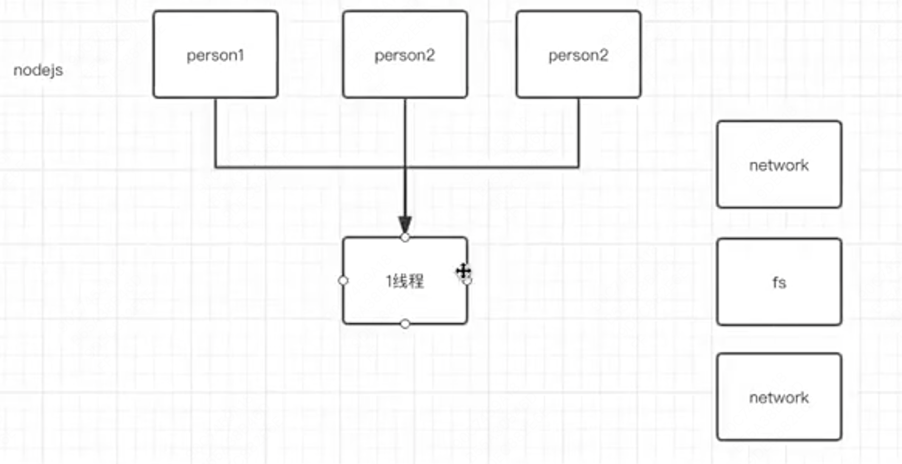
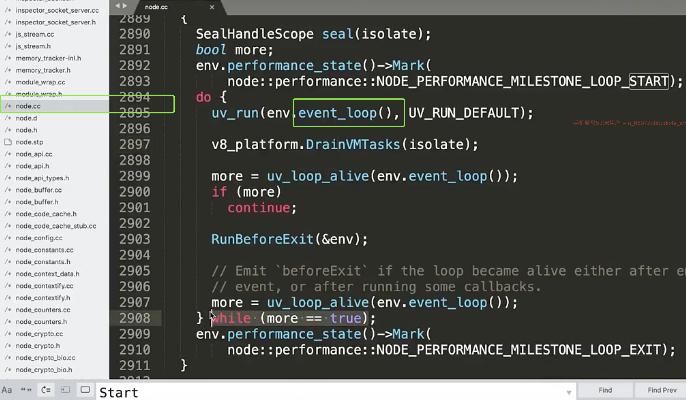

# nodejs

在我们执行`node a.js`之后，Node会启动一个进程，1个Js执行线程，但还有其他多个线程是底层node启动的，包括`fs``network`等



在服务器应用中避免使用 `sync`结尾的同步api，比如 `readFileSync`等，因为会阻塞线程，影响性能

核心模块：

- http

- fs

- stream 句柄，句柄可以理解为nodejs把底层功能封装了一个模块，提供给上层开发者调用。

```js
(req, res) => {
    http.get('url', (data) => {
        let body = '';
    
        data
            .on('data', (chunk) => {
                body += chunk;
            })
            .on('end', () => {
                const jsonObj = JSON.parse(body);
                res.write(JSON.stringify({
                    data: [jsonObj]
                }))
                res.end();
            })
    })
}

```

```sh
node server.js
```
这里的node 本质就是一个编译好的二进制文件。同样可以写成这样

```sh
/usr/local/bin/node server.js
```

Node源码 C实现的：

;

这里展示了核心功能 事件循环