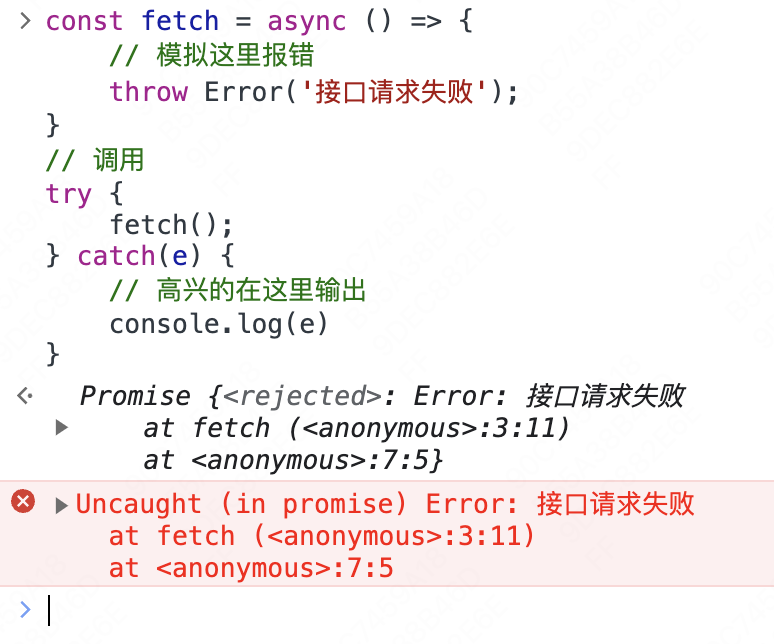

# 开始

哎 定个文件夹名好难...我就是想记录下开发中使用promise不到位的地方，纠正过来也算一种技巧，同时也能帮助我加深对于原理的理解。

## async/await和try/catch的结合

最近写了一个async函数请求接口，为了防止接口报错后乱抛error，我给函数外层加了try/catch，代码如下
```js
const fetch = async () => {
    // 模拟这里报错
    throw Error('接口请求失败');
}
// 调用
try {
    fetch();
} catch(e) {
    // 高兴的在这里输出
    console.log(e)
}
```
我希望，代码的报错可以在catch中被消化，而不是直接冒到浏览器控制台来恶心别人...但不出意外的话，就出意外了


感觉代码里面缺了点什么，好像就是没有用`await`关键字。但是一般情况下如果`await`下面还有其他代码，需要加`await`保持类似同步的执行。但是如果下面没有其他代码了，我一般就不会加`await`。

讲道理不加`await`没问题，但是如果是想要配合`try/catch`来使用，就不行了。

### 原因

`fetch`函数执行后会立即返回一个未处理的`promise`，这样后面的代码就不会等待`fetch()`的完成。

因此，当fetch中抛出异常，此时代码已经**离开**`try/catch`块，所以错误就不会被捕获。

但如果使用`await`关键字，就会告诉js引擎，需要等到`fetch()`执行结束，这样代码执行就会暂停在`fetch()`这里，并等待其返回`promise`是`resolve`还是`reject`。如果`resolve`则继续执行`try`块的后续代码，否则`reject`则进入`catch`块中进行错误处理。

以上，Easy~

### 反思

`await`的作用就是等待`promise`返回结果。当`fetch()`被包裹到`try/catch`中，catch部分也同样是`fetch`的**后续代码**，一样需要加`await`来当做同步来执行。

自己还是不够细~
