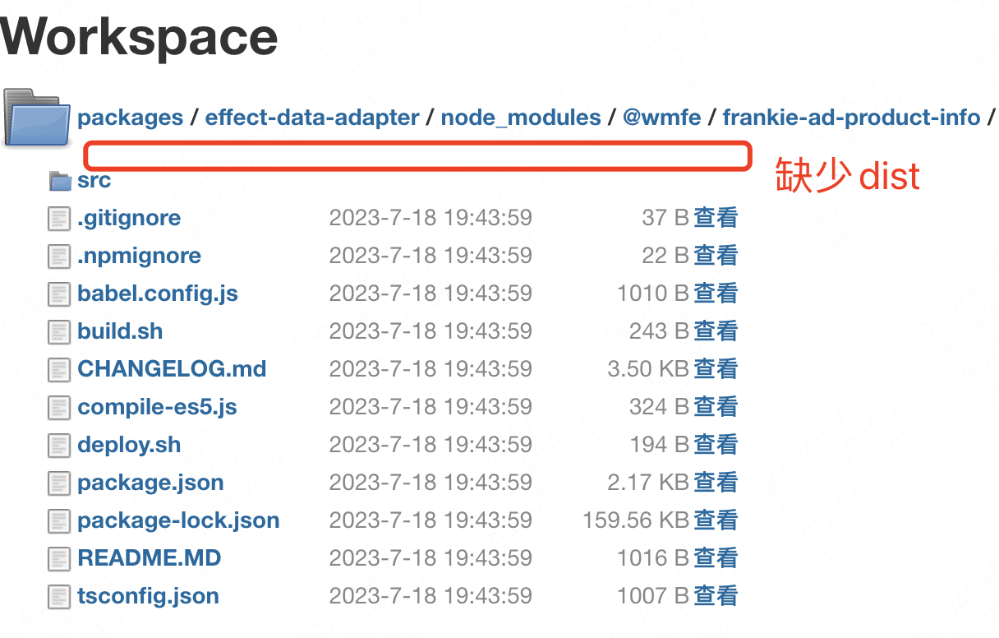
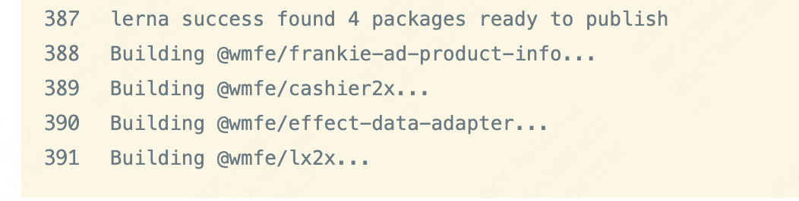

# 前面

最近接手的一些需求是基于`lerna`实现的，这里主要记录在使用过程中遇到的问题，通过问题学习`lerna`。

## 关于lerna publish 

`lerna publish`是发布命令，其中包含很多参数，这里不一一描述。

### 问题1: `cannot find xxx module`

#### 表现

命令：`lerna publish --conventional-commits --conventional-prerelease=* --no-changelog --preid=beta --amend`

1. 在运行publish之后，首先会列出本次即将发布的包列表，可以理解为内部执行了 `lerna changed`
2. 之后会依次按照包列表执行`build`构建
3. 构建过程中，TS会出现报错: `Cannot find module 'xxx' or its corresponding type declarations.`

#### 问题分析

**初步排查->解决**

由于报错的包属于A包依赖B包中的B包，是一个被依赖的包，在A包pkg.json中的denpendence 是通过相对路径引入的：
```js
"dependencies": {
    "xxx": "file:../yyy"
},
```
在查阅`lerna`文档后，感觉是依赖问题，比如包之间相互依赖没有“处理好” ，于是第一次改动尝试。

在发布脚本里面增加`bootstrap`命名。。然并卵。。。

```shell
# 重新安装依赖，处理引用关系
npx lerna bootstrap

# 发布
npx lerna publish ...
```
**进一步排查->解决**

由于构建部署流程都是在远端执行的，所以直接对应的jenkins机器上查看构建后的产物。

正常情况下B包中应该存在类似`dist`或者`build`这样的文件夹，存放包的**入口文件**



发现确实无论在B包中，还是A的`node_modules`中，都没有包的入口文件。。。感觉问题就是这里了，但还是有点别扭，为什么其他待发的包都正常的构建产物？

尝试了一种解决方案：在发布前脚本中，增加B包的build命令。

```shell
# 前置代码 ...

# run build + scope过滤
npx lerna run build --scope=@xxx包

# 发布publish ...
```

确实问题解决了~ 但是也只是浅浅验证了一下，确实是包没有构建产物，导致找不到包入口，从而引起的`cannot find xxx`报错。

**思考**

在这个解决方案基础优化下，肯定不能指定写死一个包... 所以最简单的，通过`lerna changed`拿到待发包列表，动态构建一次。代码：

```shell
# 前置代码 ...

# 获取变更的包名
changed_packages=$(npx lerna changed --json | jq -r '.[].name')

# 构建变更的包
for package in $changed_packages
do
  npx lerna run build --scope $package
done

# 发布publish ...
```
可以看到，即将发布4个包，并一次执行`build`命令，动态的解决了这个问题



**进进一步分析思考**

以终为始...

我仅执行了一个`lerna publish`，但是中间却有很多层处理包括，这里我只列举我看到的（通过Jenkins中的日志进行排查）：

1. 列举待发布包 -> `lerna changed`
2. 构建待发布包 -> `lerna run build`
3. 更新包版本号，打tag -> `lerna version`
4. 发布到npm仓库 -> `npm publish`

这其中应该还有很多细节处理，比如生命周期钩子等等，我就不知道了。。。

于是呼，我去看了看`lerna publish`的[源码](https://github.com/lerna/lerna/tree/main/libs/commands/publish#readme)，一个字 **刺激** ~~ G了，内容太多直接劝退。。。

但是我又找到了一篇大佬的[深入分析好文](https://cloud.tencent.com/developer/article/1883132) 😋

在一顿学习下来，发现`publish`代码里面，压根就没有关于`build`构建的影子。。。这。。。

**那命令是怎么运行待发包的构建命令的呢？？？**

在不经意间，我发现一个词**version的钩子**

```
# preversion:  Run BEFORE bumping the package version.
# version:     Run AFTER bumping the package version, but BEFORE commit.
# postversion: Run AFTER bumping the package version, and AFTER commit.
```

这个**preversion**看起来就很亲切，因为这里可以做`build`操作啊！！！

果然子包里面发现，除了报错的B包，没有这行script之外，其他待发包都有，且都正常。

```json
"scripts": {
    "preversion": "npm run build"
}
```

结局了。。。在B包中加上这行命令后，`publish`终于正常了。困扰好久的问题，今天终于被攻破了。撒花🌹

**遗留**

Q：之前遗留了一个问题，就是为什么前置 `yarn install`了，但B包竟然没有dist产物？

A：那是因为AB包互相依赖时，A包是使用**相对路径**进行的引入 `@xxx包: file: ./yyy`，这种方式和传统的按照版本号引入`@xxx包: ^1.2.0`完全不同。

相对路径引入的包，就是`monorepo`工程中的子包代码，这就等于`install`的是源码，就是`src`下面的代码，还没有构建过。所以需要借助`lerna`的构建能力，才能正常引入。

传统版本号的包，我们用的最多，因为`install`的已经是上传到npm仓库的代码，包含构建后的入口，所以可以正常使用。

#### 思考

**以终为始**。解决问题还是得抓住问题向前推演，不能盲目尝试

看`lerna`的设计，我天真的以为`publish`包含了`build`的功能，但其实大佬是通过生命周期钩子对 `version`进行了【前，中，后】钩子处理，直接把构建部分解耦了。不得不说，这波我在一层，大佬5层。瑞思拜~


