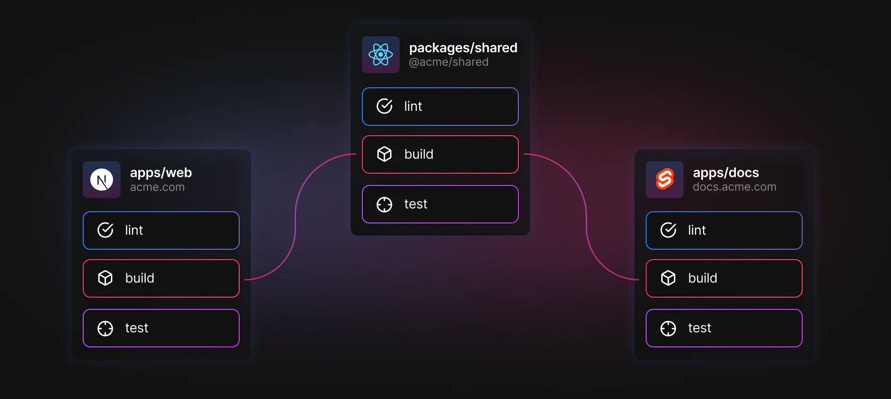
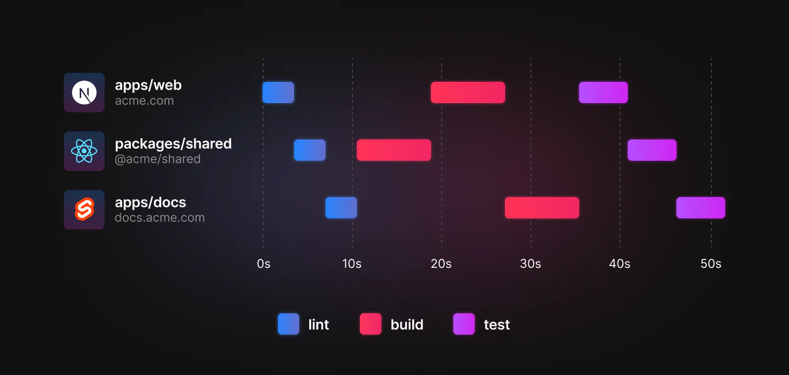
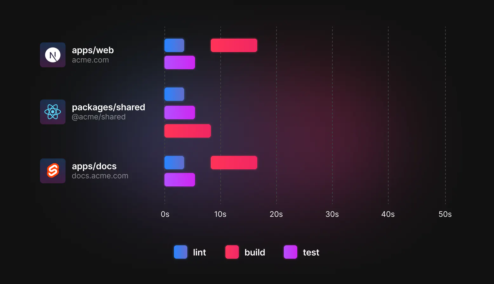

# monorepo

Monorepo是一种项目管理方式，在它之前，管理方式是MultiRepo，即每个项目对应一个仓库。这会导致一些弊端，比如代码管理分散、相同功能在每个仓库重复维护等问题。

Monorepo 必备3大能力：

- 依赖管理能力
- 任务编排能力
- 版本发布能力


常见Monorepo工具有：

| 工具      | 依赖管理能力 | 任务编排能力 | 版本发布能力 |
| ----------- | ----------- | ----------- | ----------- |
| Pnpm Workspace | ✅  |  ✅ | ❌ |
| Rush   | ✅  | ✅ | ✅ |
| Lage   | ❌ | ✅ | ❌ |
| Lerna   | ❌ | ✅ | ✅ |
| Turborepo | ❌ | ✅ | ❌ |

- [Pnpn](https://pnpm.io/) Pnpm除了具备高性能的依赖管理能力之外，还可以通过 `--filter`参数支持一定任务编排，所以也将其列入。
- [Rush](https://rushjs.io/) 由微软开源的可扩展 Monorepo 管理方案，内置 PNPM 以及类 Changesets 发包方案，其插件机制是一大亮点，使得利用 Rush 内置能力实现自定义功能变得极为方便
- [Lage](https://microsoft.github.io/lage/) 同样是微软开源，可以算是`Turbo`前身，同样是Go语言实现，但相较于`Turbo`人气差了一个级别。
- [Lerna](https://lerna.js.org/) 比较成熟，中规中矩menorepo方案，目前已经停止维护。

依赖管理过于底层，版本控制较为简单且已成熟，将这两项能力再做突破是比较困难的，实践中基本都是结合 `Pnpm` 以及 `Changesets` 补全整体能力，甚至就干脆专精于一点，即任务编排，也就是 Turborepo 的发力点。


# Turborepo

## 是什么

Turborepo 是一个适用于 JavaScript 和 Typescript monorepo 的高性能构建工具，它不是一个侵入式的工具，你可以在项目中渐进的引入和使用它，它通过足够的封装度，使用一些简单的配置来达到高性能的项目构建。
和esbuild一样，Turborepo也是基于go实现的工具，在语言层面上就具有一定的性能优势。

这里大家可以了解下它的兄弟产品**Turbopack**，号称比`vite`还快10倍的构建工具🐂🍺

`Turborepo`和`Turbopack`两款产品，底层依赖`Turbo`

## 优势

### 多任务并行处理

在我们对多个子包执行构建时，`Turbo`会并行执行多个任务，这样可以大大提高构建速度。

对比传统的`lerna`或者`yarn`，它们内部都提供了类似`workspace run`这样的命令。每个子项目的`script`脚本，都以**拓扑**方式被运行。

什么是**拓扑**

> 拓扑 是一种排序 拓扑排序是依赖优先的术语， 如果 A 依赖于 B，B 依赖于 C，则拓扑顺序为 C、B、A。
> 比如一个较大的工程往往被划分成许多子工程，有些子工程必须在其它有关子工程完成之后才能开始，也就是说，一个子工程的开始是以它的所有前序子工程的结束为先决条件的

下面对比图，来看`Turbo`和`lerna`处理任务的方式

子包关系：



`lerna`执行任务：



`Turbo`执行任务：



很明显，`Turbo`可以并行执行多个任务，而`lerna`只能串行执行。性能不言而喻

### 增量构建

`Turbo`中依赖缓存机制(会记录构建内容，并跳过已经计算过的内容)，实现增量构建，提升构建效率。

### 云缓存

`Turbo`通过其远程缓存功能可以帮助多人远程构建云缓存实现了更快的构建。

### 任务管道

可以用配置文件定义任务间的关系，然后让`Turbo`优化构建内容和时间

### 约定配置

通过约定降低复杂性，只需几行`JSON`即可配置整个项目依赖，执行脚本的顺序

### 浏览器中的配置文件

生成构建配置文件，可以在浏览器中查看任务的花费时长。

## Turbo核心概念

### 管道 pipeline

- 通过`pipeline json`可以显式指定任务关系
- `pipeline`中的每一个`key`，都指向`package.json`中的`script`脚本，并且都可以被`turbo run `所运行
- `turbo`最终会根据这分配至，对每个子package有序执行脚本和优化缓存输出

```js

// turbo.json
{
  "$schema": "https://turborepo.org/schema.json",
  "pipeline": {
    "build": {
      // A package's `build` script depends on that package's
      // dependencies' and devDependencies'
      // `build` tasks  being completed first
      // (the `^` symbol signifies `upstream`).
      "dependsOn": ["^build"],
      // note: output globs are relative to each package's `package.json`
      // (and not the monorepo root)
      "outputs": [".next/**"]
    },
    "test": {
      // A package's `test` script depends on that package's
      // own `build` script being completed first.
      "dependsOn": ["build"],
      "outputs": [],
      // A package's `test` script should only be rerun when
      // either a `.tsx` or `.ts` file has changed in `src` or `test` folders.
      "inputs": ["src/**/*.tsx", "src/**/*.ts", "test/**/*.ts", "test/**/*.tsx"]
    },
    "lint": {
      // A package's `lint` script has no dependencies and
      // can be run whenever. It also has no filesystem outputs.
      "outputs": []
    },
    "deploy": {
      // A package's `deploy` script depends on the `build`,
      // `test`, and `lint` scripts of the same package
      // being completed. It also has no filesystem outputs.
      "dependsOn": ["build", "test", "lint"],
      "outputs": []
    }
  }
}

```

#### DependsOn依赖

假设你的应用中的3个包，有如下依赖关系，`apps/web`和`apps/docs`依赖`packages/shared`的构建产物


```js
  "pipeline": {
    "build": {
      "dependsOn": ["^build"]
    }
  }
```

#### 常规依赖

如果一个任务的执行，只依赖自己包的其他任务，那么可以使用常规依赖

```js
  "pipeline": {
    "deploy": {
      "dependsOn": ["build", "test", "lint"]
    }
  }
```

#### 拓扑依赖

如果一个任务的执行，依赖自己包的其他任务，也依赖其他包的任务，那么可以使用拓扑依赖

```js
  "pipeline": {
    "build": {
      "dependsOn": ["^build"]
    }
  }
```

特别注意：`dependsOn`表示当前命令所依赖的命令，`^`表示`devDependencies`和`dependencies`中的所有依赖都执行完`build`之后，才会执行`build`

#### 空依赖

如果一个任务的执行，不依赖任何其他任务，那么可以使用空依赖。此时这个任务可以在任何时间被执行。

```js
  "pipeline": {
    "lint": {
      "dependsOn": []
    }
  }
```

#### outputs

`outpus`表示命令执行输出的文件缓存目录，默认值 `["dist/**", "build/**"]`

#### cache

`cache`表示是否缓存，通常在执行`dev`命令时，不需要缓存。

```js
{
  "$schema": "https://turborepo.org/schema.json",
  "pipeline": {
    "dev": {
      "cache": false
    }
  }
}

```

#### input

表示命令执行所依赖的文件，如果文件发生变化，那么命令会被重新执行。

例如，可以用它来帮助你跳过单元测试，除非源文件发生更改。

默认为`[]`，表示任何文件变化都会触发命令执行。

```js
{
  "$schema": "https://turborepo.org/schema.json",
  "pipeline": {
    "test": {
      "inputs": ["src/**/*.tsx", "src/**/*.ts", "test/**/*.ts", "test/**/*.tsx"]
    }
  }
}

```

#### outputMode

表示输出模式，包含：

- `full`(默认值) ，显示任务的整个输出

- `new-only`，显示缓存未命中的完整输出和缓存命中的计算哈希值。意思就是返回带有hash的日志并且当如果有未命中的子包缓存或者打包错误导致缓存未命中再次打包时会输出上一次缓存未命中的的子包完整任务输出日志

- `hash-only`，仅显示计算的任务哈希

- `none`，隐藏任务输出，即不会打印拓扑顺序和打包输出日志

### 命令行使用

#### 全局参数

##### `--continue`

`true`：`turbo`将以执行期间遇到的最高退出代码值退出。

默认`false`

```
turbo run build --continue
```

##### `--parallel`

脚本程序并行运行命令并忽略依赖关系图。这对于使用实时重新加载进行开发很有用。例如我们启动vite项目的时候我们就需要忽略其他可能出现的dependsOn依赖关系

默认`false`

```json
"pipeline": {
  "build": {
    "dependsOn": ["^build"],
    "outputs": ["dist/**", "build/**"],
    "outputMode": "new-only"
  },
  "lint": {
    "outputs": []
  },
  "dev": {
    "cache": false,
    //
    "dependsOn": ["^build"]
  }
}
```

由于我们在pipeline中设置了dependson的build命令依赖优先的问题所以我们可以指定--parallel并行执行并且阻止默认依赖 build 指令

```
turbo run lint --parallel --no-cache
turbo run dev --parallel --no-cache
```

##### `--filter`


##### `--force`


##### `--no-cache`


##### `--only`


## 实战部分

将已有`lerna yarn`改成`turborepo`