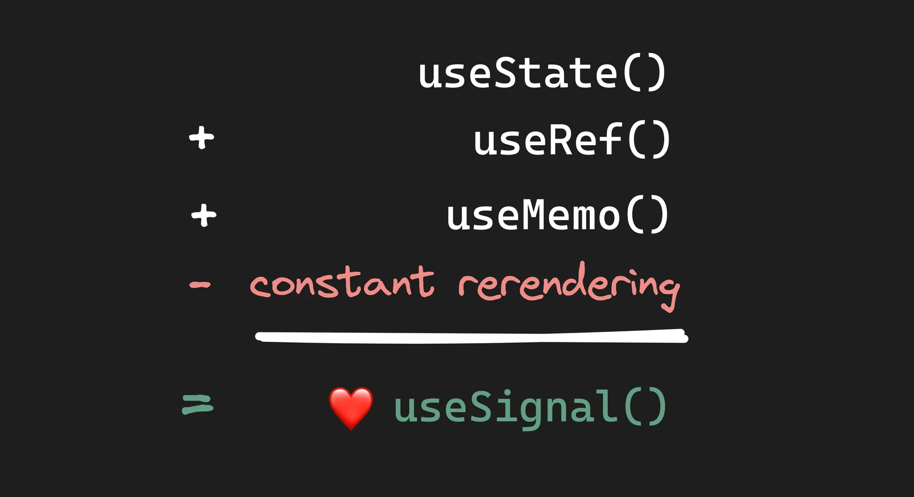
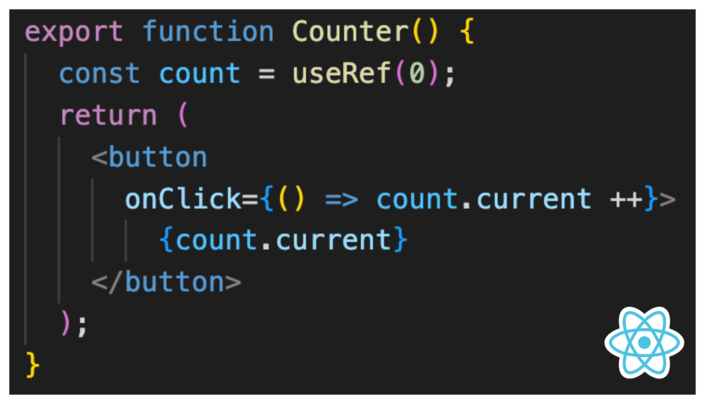

# 关于react框架的认识和思考

## 从[一片文章](https://mp.weixin.qq.com/s/I_mP_LJDB9PCk3zawjWHBA)中的收获和总结

文章的名字叫**我被 React 劫持了，很痛苦又离不开**。看名字以为是小黑子对react的抱怨，其实并没有无脑抱怨，而是结合自身经验和react发展现状做出的一些总结，并且文章作者也是资深reactor，所以这篇文章实际包含了作者对react的深入理解和思考，很值得仔细品一品~ 可惜我本人也是出学react不久，所以这里就浅显的做了一些摘抄，把我现阶段能理解的内容整理下来。以后如果更加精进了，可以回头再刷，肯定会有更多感同身受的点吧~

### 1. react和hooks

> 当我们抽象复杂的系统时，不是在消除复杂性，而是在转移它。在我们的例子中，复杂系统不是 前端开发，而是 React

> Hooks 改变了我们的心理模型，它让我们考虑状态转换和同步，而不是生命周期。

```js
componentDidMount → useEffect(func, [])
componentWillUnmount → useEffect(() => func, [])
componentDidUpdate → useEffect(func, [props])
```
上面这个例子可以理解~ 在函数组件中没有生命周期的相关钩子，可以通过`useEffect`去模拟.... 但对比`Vue的hooks`还保留生命周期的hook哦


> 对于状态`state`和`props`来说，并不存储在组件中，而是维护在**状态树vdom**中

TODO

这里确实不清楚hooks的工作机制，怎么触发的渲染，回头可以看源码理解一下。。。

### 2. 关于重复渲染的问题
> 组件是一个函数，每次需要检测更新时，都需要重新执行，可能dom没有发生实际变化，但是内部的方法都需要重新执行计算。

这个很好理解~ 如何避免重复执行计算，就涉及到后面提到的记忆方法。

这里有个demo辅助理解：
```js
// 自定义input组件
const MyInput = ({label, value}) => {
    // handleLabel内部有复杂逻辑计算
    const labelText = handleLabel(label);
    return (
        <>
            <label>{labelText}</label>
            <input value={value}></input>
        <>
    )
}
```
```js
const MyForm = () => {
    const [text1, setText1] = useState('');
    const [text2, setText2] = useState('');
    const [text3, setText3] = useState('');

    return <form>
        <MyInput value={text1} onInput={e => setText1(e.currentTarget.value)} />
        <MyInput value={text2} onInput={e => setText2(e.currentTarget.value)} />
        <MyInput value={text3} onInput={e => setText3(e.currentTarget.value)} />
    </form>;
}
```
这样每次按键输入，都引起`MyInput`函数组件的执行。

这种情况太常见了，由于浏览器硬件给力，所以即使重复执行看起来也不影响使用 ...


### 3. 关于记忆memo

[use记忆](./use%E8%AE%B0%E5%BF%86.md)

### 4. 关于信号Signal

原来来源：[useSignal](https://www.builder.io/blog/usesignal-is-the-future-of-web-frameworks)

借用一张图说明



#### 是什么

signal（信号）是一种存储应用状态的形式，类似于 React 中的 useState()。 但是，有一些关键性差异使 Signal 更具优势。Vue、Preact、Solid 和 Qwik 等流行 JavaScript 框架都支持 Signal。

Signal 和 State 之间的主要区别在于 Signal 返回一个 getter 和一个 setter，而非响应式系统返回一个值和一个 setter。


#### useState缺点


React 的 useState() 会返回一个状态值。这意味着 useState() 不知道组件或应用内部如何使用状态值。所以，一旦通过调用 setCount() 通知 React 状态更改，React 就不知道页面的哪一部分发生了更改，因此必须重新渲染整个组件，这在计算上是很昂贵的。

#### useRef

React 的 useRef() 类似于 useSignal()，但它不会导致页面重新渲染。下面的例子看起来与 useSignal() 非常相似，但它不起作用



#### useMemo