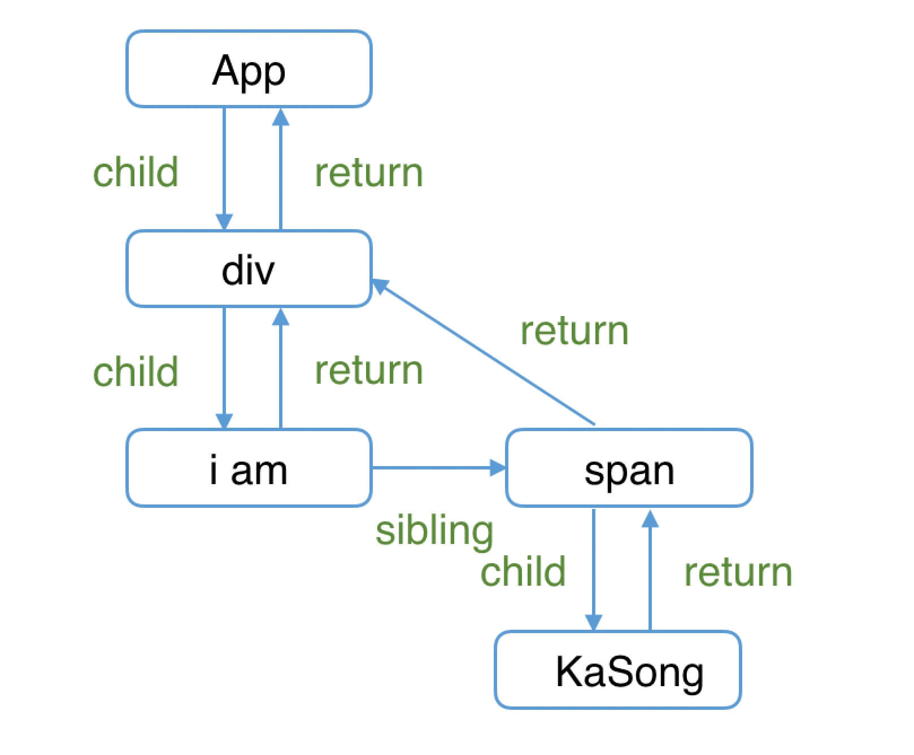
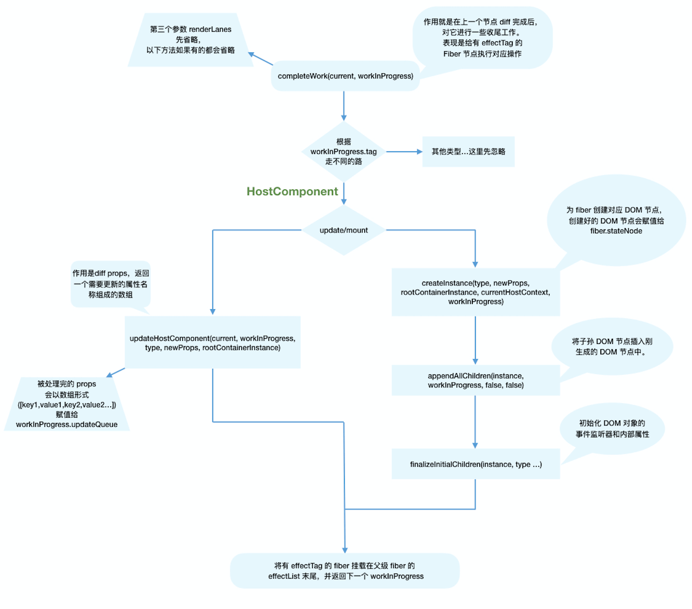

# render阶段

主要理解`Fiber`构建和`Fiber`树生成

`render`阶段开始于 `performSyncWorkOnRoot` 和 `performConcurrentWorkOnRoot` 的调用，这取决于本次更新是同步还是异步更新。

```js
// performSyncWorkOnRoot会调用该方法
function workLoopSync() {
  while (workInProgress !== null) {
    performUnitOfWork(workInProgress);
  }
}

// performConcurrentWorkOnRoot会调用该方法
function workLoopConcurrent() {
  while (workInProgress !== null && !shouldYield()) {
    performUnitOfWork(workInProgress);
  }
}
```

`Fiber Reconciler`是从通过遍历来实现异步中断的递归，所以`performUnitOfWork`工作可以分为 **“递”**和 **“归”**

## “递”阶段

会从`rootFiber`节点往下做**深度优先遍历**。为每一个`Fiber节点`调用[`beginWork`](https://github.com/facebook/react/blob/970fa122d8188bafa600e9b5214833487fbf1092/packages/react-reconciler/src/ReactFiberBeginWork.new.js#L3058)方法，该方法会根据传入的`Fiber`节点，创建`子Fiber`节点，同时将这两个节点连接起来。

当遍历到叶子节点（没有子组件时），就会进入**归**阶段。

## “归”阶段

归阶段会调用[`completeWork`](https://github.com/facebook/react/blob/970fa122d8188bafa600e9b5214833487fbf1092/packages/react-reconciler/src/ReactFiberCompleteWork.new.js#L652)处理`Fiber节点`。

当某个`Fiber`节点执行完毕之后，如果其存在兄弟`Fiber节点`，（即`fiber.sibling !== null`），会进入其`兄弟Fiber`的“递”阶段。

“递和归”会交错执行，直到“归”到`rootFiber`。至此，`render`阶段工作结束。

下面有个例子：

```js
function App() {
  return (
    <div>
      i am
      <span>KaSong</span>
    </div>
  )
}

ReactDOM.render(<App />, document.getElementById("root"));
```

fiber树：



`render阶段`执行过程

```sh
1. rootFiber beginWork
2. App Fiber beginWork
3. div Fiber beginWork
4. "i am" Fiber beginWork
5. "i am" Fiber completeWork
6. span Fiber beginWork
7. span Fiber completeWork
8. div Fiber completeWork
9. App Fiber completeWork
10. rootFiber completeWork
```

> 之所以没有"KaSong"节点的beginWork和completeWork，是因为对于单一文本子节点的fiber，react会进行性能优化

## `beginWork`

[源码](https://github.com/facebook/react/blob/1fb18e22ae66fdb1dc127347e169e73948778e5a/packages/react-reconciler/src/ReactFiberBeginWork.new.js#L3075)

**主要工作：** 传入当前`Fiber节点`，创建`子Fiber节点`

```js
function beginWork(
  current: Fiber | null,
  workInProgress: Fiber,
  renderLanes: Lanes
): Fiber | null {
  // ...
}
```

- `current`：当前组件的`Fiber节点`对应的**上一次**更新的`Fiber节点`

- `workInProgress`：当前组件对应的`Fiber节点`

- `renderLanes`：更新优先级

组件更新分为 `mount` 和 `update` 两个阶段，在`mount`阶段，由于组件不存在上一次更新的`Fiber节点`，所以 `current === null`，

所以 `update`对应的`current !== null`

所以`beginWork`内部区分了 `mount`和`update`2个阶段的逻辑，这里有2个注意点：

- `update`时，会根据情况，复用`current`，即上一次更新的Fiber节点

- `mount`时，会根据`workInProgress.tag`创建不同的`子Fiber节点`


```js
function beginWork(
  current: Fiber | null,
  workInProgress: Fiber,
  renderLanes: Lanes
): Fiber | null {

  // update时：如果current存在可能存在优化路径，可以复用current（即上一次更新的Fiber节点）
  if (current !== null) {
    // ...省略

    // 复用current
    return bailoutOnAlreadyFinishedWork(
      current,
      workInProgress,
      renderLanes,
    );
  } else {
    didReceiveUpdate = false;
  }

  // mount时：根据tag不同，创建不同的子Fiber节点
  switch (workInProgress.tag) {
    case IndeterminateComponent: 
      // ...省略
    case LazyComponent: 
      // ...省略
    case FunctionComponent: 
      // ...省略
    case ClassComponent: 
      // ...省略
    case HostRoot:
      // ...省略
    case HostComponent:
      // ...省略
    case HostText:
      // ...省略
    // ...省略其他类型
  }
}
```

### update

看源码中，在`update`的判断下，满足以下情况，`didReceiveUpdate = false`，（即可以复用子Fiber节点，不需要新建）

- `oldProps === newProps && workInProgress.type === current.type`，即props与fiber.type不变

- `!includesSomeLane(renderLanes, updateLanes)`，即当前Fiber节点优先级不够

### mount

主要是根据 `workInProgress.tag`来创建不同类型的子Fiber节点

> [源码这里](https://github.com/facebook/react/blob/1fb18e22ae66fdb1dc127347e169e73948778e5a/packages/react-reconciler/src/ReactWorkTags.js) 全部tag类型

### reconcileChildren

[源码](https://github.com/facebook/react/blob/1fb18e22ae66fdb1dc127347e169e73948778e5a/packages/react-reconciler/src/ReactFiberBeginWork.new.js#L233)

它是`Reconciler`的核心：

- 对于`mount`，它会创建子Fiber节点

- 对于`update`，它会**对比**组件当前与上次更新的`Fiber节点`，生成新的`Fiber节点`。也就是 `Diff`算法

```js
export function reconcileChildren(
  current: Fiber | null,
  workInProgress: Fiber,
  nextChildren: any,
  renderLanes: Lanes
) {
  if (current === null) {
    // 对于mount的组件
    workInProgress.child = mountChildFibers(
      workInProgress,
      null,
      nextChildren,
      renderLanes,
    );
  } else {
    // 对于update的组件
    workInProgress.child = reconcileChildFibers(
      workInProgress,
      current.child,
      nextChildren,
      renderLanes,
    );
  }
}
```

这里注意：

1. `mount`和`update`最后都会把生成的`fiber`赋值给`workInProgress.child`

2. `reconcileChildFibers`有点区别是，会给生成的`Fiber节点`打上`effectTag`属性。`mountChildFibers`则不会

### effectTag

`render阶段`是在内存中完成的，它工作结束会通知`Renderer`去渲染`DOM`，而要执行`DOM`操作的具体类型就保存在 `fiber.effectTag`中

> [这里](https://github.com/facebook/react/blob/1fb18e22ae66fdb1dc127347e169e73948778e5a/packages/react-reconciler/src/ReactSideEffectTags.js) 看`effectTag`对应的`DOM`

这里使用**二进制**来表示`effectTag`，方便位运算

举例，如果要通知`Renderer`将`Fiber节点`中对应的`DOM节点`插入到页面中，需要满足：

1. `fiber.stateNode`存在，即fiber中保存的`DOM节点`信息存在

2. `fiber.effectTag & Placement !== 0`，即`Fiber节点`存在“插入”的属性

### beginWork流程图


## completeWork

[源码](https://github.com/facebook/react/blob/1fb18e22ae66fdb1dc127347e169e73948778e5a/packages/react-reconciler/src/ReactFiberCompleteWork.new.js#L673)

方法概览，重点关注`HostComponent`

```js
function completeWork(
  current: Fiber | null,
  workInProgress: Fiber,
  renderLanes: Lanes,
): Fiber | null {
  const newProps = workInProgress.pendingProps;

  switch (workInProgress.tag) {
    case IndeterminateComponent:
    case LazyComponent:
    case SimpleMemoComponent:
    case FunctionComponent:
    case ForwardRef:
    case Fragment:
    case Mode:
    case Profiler:
    case ContextConsumer:
    case MemoComponent:
      return null;
    case ClassComponent: {
      // ...省略
      return null;
    }
    case HostRoot: {
      // ...省略
      updateHostContainer(workInProgress);
      return null;
    }
    case HostComponent: {
      // ...省略
      return null;
    }
  // ...省略
```

### HostComponent

原生DOM组件对应的`Fiber节点`

和`beginWork`一样，还是通过 `current === null` 来判断是`mount`还是`update`阶段

同时`update`阶段还需要判断`workInProgress.stateNode !== null`，即`Fiber节点`是否有对应的`DOM节点`

```js
case HostComponent: {
  popHostContext(workInProgress);
  const rootContainerInstance = getRootHostContainer();
  const type = workInProgress.type;

  if (current !== null && workInProgress.stateNode != null) {
    // update的情况
    updateHostComponent(
      current,
      workInProgress,
      type,
      newProps,
      rootContainerInstance,
    );
  } else {
    // mount的情况
    // ...省略
  }
  return null;
}
```

### update时

由于`Fiber`已经存在对应的`DOM节点`，所以不用生成`DOM`，只需要关心处理`props`，比如：

- `onClick`、`onChange`回调

- 处理`style prop`

- 处理`DANGEROUSLY_SET_INNER_HTML prop`

- 处理`children prop`

[updateHostComponent源码](https://github.com/facebook/react/blob/1fb18e22ae66fdb1dc127347e169e73948778e5a/packages/react-reconciler/src/ReactFiberCompleteWork.new.js#L225)

在内部，处理后的props，会被赋值给`workInProgress.updateQueue`，在`commit`阶段来统一渲染

```js
workInProgress.updateQueue = (updatePayload: any);
```

其中`updatePayload`为数组形式，他的偶数索引的值为变化的`prop key`，奇数索引的值为变化的`prop value`。

### mount时

主要做3件事：

- 为`Fiber节点`生成对应的`DOM节点`

- 将子孙`DOM节点`插入刚生成的`DOM节点`中

- 与`update`逻辑中的`updateHostComponen`t类似的处理`props`的过程

```js
// mount的情况

// ...省略服务端渲染相关逻辑

const currentHostContext = getHostContext();
// 为fiber创建对应DOM节点
const instance = createInstance(
    type,
    newProps,
    rootContainerInstance,
    currentHostContext,
    workInProgress,
  );
// 将子孙DOM节点插入刚生成的DOM节点中
appendAllChildren(instance, workInProgress, false, false);
// DOM节点赋值给fiber.stateNode
workInProgress.stateNode = instance;

// 与update逻辑中的updateHostComponent类似的处理props的过程
if (
  finalizeInitialChildren(
    instance,
    type,
    newProps,
    rootContainerInstance,
    currentHostContext,
  )
) {
  markUpdate(workInProgress);
}
```

还记得上一节我们讲到：`mount`时只会在`rootFiber`存在`Placement effectTag`。那么`commit`阶段是如何通过一次插入DOM操作（对应一个`Placement effectTag`）将整棵DOM树插入页面的呢？

原因就在于`completeWork`中的`appendAllChildren`方法。

由于`completeWork`属于“归”阶段调用的函数，每次调用`appendAllChildren`时都会将已生成的子孙DOM节点插入当前生成的`DOM节点`下。那么当“归”到`rootFiber`时，我们已经有一个构建好的离屏DOM树。


### effectList

`effectTag`作为`DOM`操作的依据。

在`commit阶段`需要找到所有具有`effectTag`的`Fiber节点`。有一种高效的方法，就是在`归`阶段来寻找，具体是在`completeWork`的父函数`completeUnitOfWork`中，每次执行完一个`completeWork`且存在`effectTag的Fiber节点`，会被保存在`effectList`的单向链表中。

所以在`commit阶段`，只需要遍历这个`effectList`就能执行所有`effect`了。


### 流程图



总结：

`completeWork`就是在上一个节点完成`diff`后，进行一些收尾工作，表现是给有`effectTag`的`Fiber节点`执行对应的操作，比如插入DOM操作


# commit 阶段 (Renderer流程)

## 概览

工作起点 `commitRoot`方法，入参是 `fiberRootNode`

上节提到 `effectList`，它是单向列表，记录了每个`Fiber节点`的`effectTag`，即`DOM`操作依据。

这些副作用对应的DOM操作，都在`commit阶段`执行。除此之外，一些生命周期（componentDidxxx），hooks（useEffect），都会在这个阶段执行。

[源码](https://github.com/facebook/react/blob/1fb18e22ae66fdb1dc127347e169e73948778e5a/packages/react-reconciler/src/ReactFiberWorkLoop.new.js#L2001)

`commit`阶段的主要工作（Renderer流程）：

- `before mutation阶段`（`DOM操作`前）

- `mutation阶段`（`DOM操作`中）

- `layout阶段`(`DOM操作`结束)

补充介绍：

在`before mutation`之前和`layout`之后，还有一些其他操作，比如`useEffect`触发，优先级重置，`ref`绑定/解绑

## before mutation之前

主要做一些变量赋值，状态重置的工作


## layout之后

主要工作：

- 处理`useEffect`

- 性能追踪相关，诸如`interaction`相关代码

- 在commit阶段会触发一些生命周期钩子（如 `componentDidXXX`）和`hook`（如`useLayoutEffect`、`useEffect`）

## before mutation阶段

### 概览

整体就是遍历`effectList`执行`commitBeforeMutationEffects`，[源码](https://github.com/facebook/react/blob/1fb18e22ae66fdb1dc127347e169e73948778e5a/packages/react-reconciler/src/ReactFiberWorkLoop.new.js#L2104-L2127)

```js
// 保存之前的优先级，以同步优先级执行，执行完毕后恢复之前优先级
const previousLanePriority = getCurrentUpdateLanePriority();
setCurrentUpdateLanePriority(SyncLanePriority);

// 将当前上下文标记为CommitContext，作为commit阶段的标志
const prevExecutionContext = executionContext;
executionContext |= CommitContext;

// 处理focus状态
focusedInstanceHandle = prepareForCommit(root.containerInfo);
shouldFireAfterActiveInstanceBlur = false;

// beforeMutation阶段的主函数
commitBeforeMutationEffects(finishedWork);

focusedInstanceHandle = null;
```

主要关注`commitBeforeMutationEffects`函数

### commitBeforeMutationEffects

```js
function commitBeforeMutationEffects() {
  while (nextEffect !== null) {
    const current = nextEffect.alternate;

    if (!shouldFireAfterActiveInstanceBlur && focusedInstanceHandle !== null) {
      // ...focus blur相关
    }

    const effectTag = nextEffect.effectTag;

    // 调用getSnapshotBeforeUpdate
    if ((effectTag & Snapshot) !== NoEffect) {
      commitBeforeMutationEffectOnFiber(current, nextEffect);
    }

    // 调度useEffect
    if ((effectTag & Passive) !== NoEffect) {
      if (!rootDoesHavePassiveEffects) {
        rootDoesHavePassiveEffects = true;
        scheduleCallback(NormalSchedulerPriority, () => {
          flushPassiveEffects();
          return null;
        });
      }
    }
    nextEffect = nextEffect.nextEffect;
  }
}
```

大致3个逻辑：主要看2,3

1. 处理`DOM节点`渲染/删除后的`autoFocus`，`blur`逻辑

2. 调用`getSnapshotBeforeUpdate`

3. 调度`useEffect`

### getSnapshotBeforeUpdate

`commitBeforeMutationEffectOnFiber`是`commitBeforeMutationLifeCycles`的别名

在该方法内会调用`getSnapshotBeforeUpdate`。

> [源码](https://github.com/facebook/react/blob/1fb18e22ae66fdb1dc127347e169e73948778e5a/packages/react-reconciler/src/ReactFiberCommitWork.old.js#L222)

在`react16`之后，`componentWillXXX`钩子前增加了`UNSAFE_`前缀。原因是`react16`由同步更新变成异步更新，即从`stack reconciler`变成`fiber reconciler`，`render阶段`的任务可能中断/重新开始，导致对应的组件可能会执行多次`componentWillXXX`函数。

这种行为和`react15`不一致，所以标记为`UNSAFE_`

> [这里有源码](https://juejin.im/post/6847902224287285255#comment)

为此，`react16`提供了代替的生命周期钩子`getSnapshotBeforeUpdate`，它是在`commit阶段`的`before mutation阶段`调用，是同步的，所以不会出现调用多次的问题

### 调度useEffect

`scheduleCallback`方法由`Scheduler`模块提供，用于以某个优先级异步调度一个回调函数

```js
// 调度useEffect
if ((effectTag & Passive) !== NoEffect) {
  if (!rootDoesHavePassiveEffects) {
    rootDoesHavePassiveEffects = true;
    scheduleCallback(NormalSchedulerPriority, () => {
      // 触发useEffect
      flushPassiveEffects();
      return null;
    });
  }
}
```

在这里，被异步调度的回调函数就是触发`useEffect`的`flushPassiveEffects`方法


### 如何异步调度，为什么？

`flushPassiveEffects`方法会先从全局变量`rootWithPendingPassiveEffects`上获取`effectList`，这个东西就是 `completeWork归阶段`提到的副作用`Fiber节点`单链表。其中副作用包括：
- 插入DOM
- 更新DOM
- 删除DOM

除此之外，当一个`FunctionComponent`内部使用`useEffect`或`useLayoutEffect`，它对应的`Fiber节点`也会被标记`effectTag`

`flushPassiveEffects`方法内，会遍历执行`effectList`中的`effect`回调函数


**异步调用的原因**：

官方给出的解释[这里](https://zh-hans.legacy.reactjs.org/docs/hooks-reference.html#timing-of-effects)

> 与 componentDidMount、componentDidUpdate 不同的是，在浏览器完成布局与绘制之后，传给 useEffect 的函数会延迟调用。这使得它适用于许多常见的副作用场景，比如设置订阅和事件处理等情况，因此不应在函数中执行阻塞浏览器更新屏幕的操作。

可见，`useEffect`异步执行的原因主要是防止同步执行时阻塞浏览器渲染

### 总结

`before mutation阶段`会遍历`effectList`，依次执行：

- 处理`DOM节点`渲染/删除后的`autoFocus`、`blur`逻辑

- 调用`getSnapshotBeforeUpdate`生命周期钩子

- 调度`useEffect`

## mutation阶段


## layout阶段


