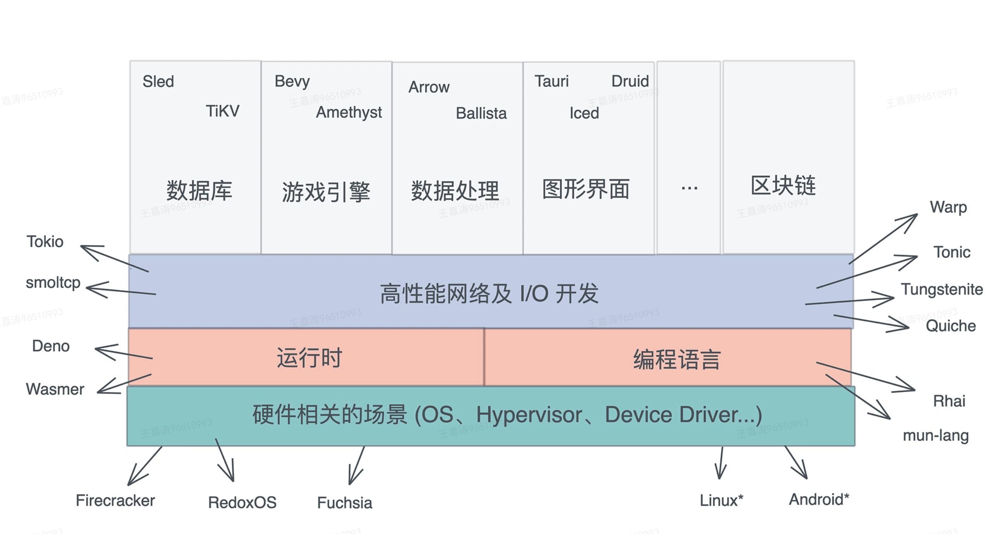
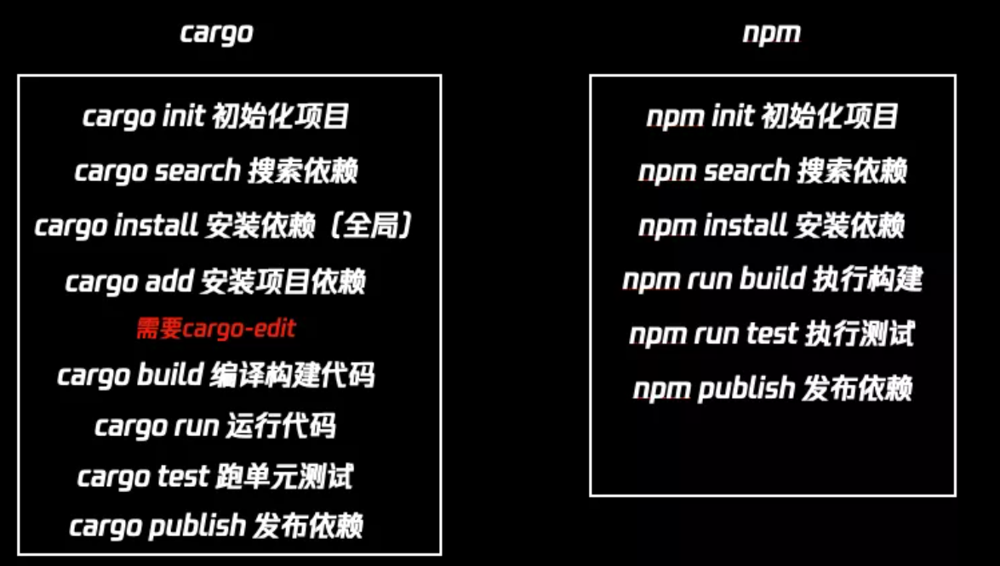
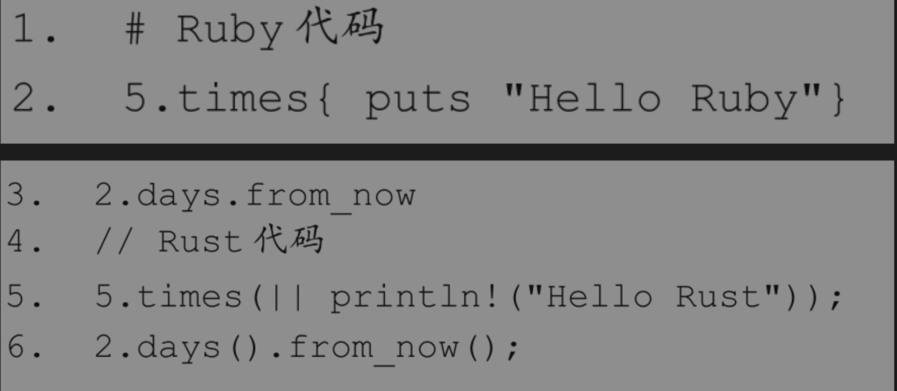
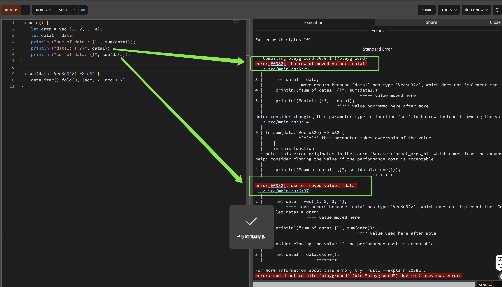
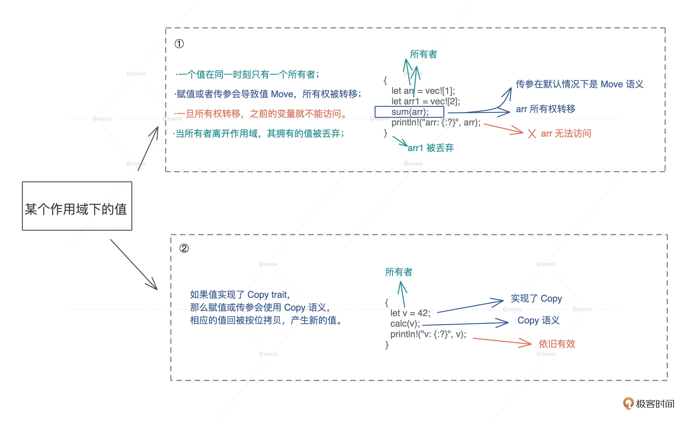
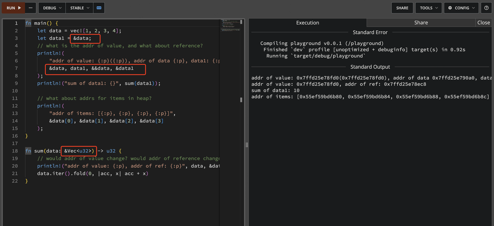
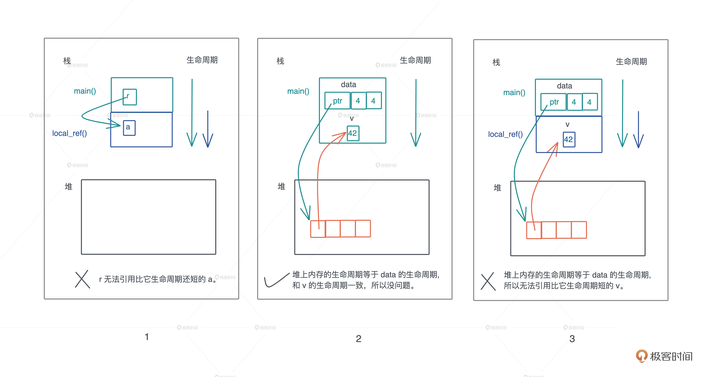

# Rust入门介绍

## 简史

作者：`Graydon Hoare`，就职于`Mozilla`

设计灵感：他所在公寓楼里一个坏掉的电梯。电梯操作系统的软件崩溃了，这时候`Hoare`意识到这类问题通常「源于程序如何使用内存的问题」。一般这些类型设备的软件是用C或C++编写的，但这些语言「需要大量的内存管理，可能导致系统崩溃的错误」。因此，Hoare着手研究如何创建一种「既紧凑又无内存错误的编程语言」。

发展历程：

2006年，`Rust`作为一个个人项目被启动

2009年，`Mozilla`开始赞助

2010年，首次公开。编译器源码迁移`rust`，称为`rustc`

2012年，发布第一个正式版rust编译器

2015年5月15日，正式发布`rust1.0`

2021年2月8日，`rust`得到 AWS、华为、Google、微软以及 Mozilla投资，并成立Rust基金会

2024年初，google向基金会捐款100万，用于改善rust和c++互操作性。


## 能干什么

### 技术无边界

一般来说，Rust 语言可以用于开发：

- 传统命令行程序 ：`Rust` 编译器可以直接生成目标可执行程序，不需要任何解释程序。

- Web 应用： `Rust` 可以被编译成 `WebAssembly，WebAssembly` 是一种 JavaScript 的高效替代品。

- 网络服务器：`Rust` 用极低的资源消耗做到安全高效，且具备很强的大规模并发处理能力，十分适合开发普通或极端的服务器程序。

- 嵌入式设备：`Rust` 同时具有JavaScript 一般的高效开发语法和 C 语言的执行效率，支持底层平台的开发。



### 前端领域

#### `SWC`

基于 Rust 的前端构建工具，可以理解为 `Rust` 版本的 `Babel`，但是性能有 10 倍提升。目前被 `Next.js、Deno , Rspack`等使用

#### `Tauri`

`Tauri` 是目前最流行的 `Electron` 替代方案，通过使用 `Rust` 和 `Webview2` 成功解决了 `Electron` 的包体积大和内存占用高的问题。

`Atom` 团队也是看到了 `Tauri` 的成功，才决定基于 Rust 去做 `Zed` 编辑器。

#### `Rspack`

字节出品，基于 `Rust` 的高性能 `Web` 构建工具, 对标 `Webpack`, 兼容大部分`api`，2014年9月初正式发布1.0版本

#### `Napi-rs`

用 `Rust` 和 `N-API` 开发高性能 `Node.js` 扩展，可以替代之前用 `C++` 开发的 `Node.js` 扩展，许多基于 `Rust` 语言开发的前端应用都结合这个库进行使用。

#### `Parcel2`

零配置构建工具，特点是快速编译和不需要配置，和 `Vite、Webpack`等打包比起来更加简单，而且是基于 `Rust` 开发

#### `Rocket`

可以帮助开发人员轻松编写安全的Web应用程序, 对标 Expressjs，性能卓越


## 优势

### 高性能

一方面，是由于它是系统级别的编程语言，性能堪比`c/c++`，无`GC`、无`运行时`，同时天然支持并发和异步。

另一方面，是它的内存管理方式。一些语言，比如`Javascript`靠引用计数器形式的垃圾回收的管理方式。另一些语言，比如`C++`靠手动管理内存的方式。

`Rust`选择第三种，通过所有权系统管理内存，编译器在编译时会根据一系列的规则进行检查。如果违反了任何这些规则，程序都不能编译。通过这种内存管理机制，使得 `Rust` 有惊人的内存利用率。


### 内存安全

`Rust` 丰富的类型系统和所有权模型保证了内存安全，通过所有权系统管理内存，编译器在编译时会根据一系列的规则进行检查，如果违反了任何这些规则，程序都不能编译。

### 线程安全

`Rust` 通过一整套基础设施和类型检查，强迫这些线程问题暴露在编译阶段，相比花费大量时间尝试重现运行时并发 bug 出现的特定情况，`Rust` 会拒绝编译不正确的代码并提供解释问题的错误信息。

## 不足

### 学习成本高

学习曲线很陡峭，主要归功于它严格的类型检测以及“所有权”的概念。借用一张极客时间中的图来说明难度


### 编译时间长

由于 Rust 的编译器进行了大量的静态检查和优化，编译时间可能相对较长，特别是对于大型项目

### 生态系统相对不太完善

相比其他编程语言，`Rust` 的生态系统相对较小，可能缺乏一些常见的库和工具

### 错误处理繁琐

`Rust` 采用了 `Result` 和 `Option` 等类型来处理错误和空值，这要求开发人员进行显式的错误处理，导致一些额外的编码工作量。

## 生态

对于前端来说，`Rust`是比较贴近前端生态的。

### rustup

是 `Rust` 的安装和版本管理工具。还包括管理一些核心工具如：`cargo（Rust版的npm）、clippy（Rust版的eslint）、rustfmt（Rust版的prettier）`。

类比`nvm`

### rustc

是 Rust 的编译器，用来将源代码和生产二进制代码，变成一个或可执行文件。

类比`webpack`等打包工具

### cargo

是 Rust 的构建工具和包管理器，它可以用来构建、测试、发布等

对比 `npm` 与 `cargo` 命令



## 核心概念

### 设计哲学

为了达成「高性能」、『足够安全』的目标，Rust遵循了三条设计原则：

- 内存安全

- 零成本抽象

- 实用性

### 内存安全

#### 解决思路

在 `Rust` 以前，引用是一种随意的、可以隐式产生的、对权限没有界定的行为，比如 C 里到处乱飞的指针、Java 中随处可见的按引用传参，它们可读可写，权限极大。

再比如JS中的对象引用，极其灵（危）活（险）

而 `Rust` 决定「限制」开发者随意**引用的行为**。

#### Rust如何保证内存安全？

首先是保证「类型安全」

> 类型安全是指类型系统可以保证程序的行为是意义明确、不出错的。像C/C++语言的类型系统就不是类型安全的，因为它们并没有对无意义。一个最简单的例子就是数组越界，在C/C++语言中并不对其做任何检查，导致发生了语言规范规定之外的行为，也就是未定义行为（Undefined Behavior）

Rust主要借鉴了`Haskell`语言的类型设计，同时结合自身”内存安全“的思想搞出了一套安全内存管理模型，通过类型系统表达出来，就保证了「内存安全」。

#### 什么是内存安全？

简单来说，就是不会出现内存访问错误

以下几种情况就会产生内存错误：

- 引用空指针

- 使用未初始化内存

- 释放后使用，也就是使用悬垂指针

- 缓冲区溢出，比如数组越界

- 非法释放已经释放过的指针或未分配的指针，也就是重复释放。

为了保证内存安全，Rust搞出了严格的内存安全模型：

- 所有权系统

- 借用和生命周期

所有权系统：每个被分配的内存都有一个独占其所有权的指针。只有当该指针被销毁时，其对应的内存才能随之被释放。

借用和生命周期：每个变量都有其生命周期，一旦超出生命周期，变量就会被自动释放。如果是借用，则可以通过标记生命周期参数供编译器检查的方式，防止出现悬垂指针，也就是释放后使用的情况。

### 零成本抽象

除了安全性，Rust还追求高效开发和性能。

要做到高效开发，就需要具备一定抽象能力。这里对比`Ruby`和`Rust`代码：



可以看出两者的抽象程度已经接近自然语言。不过`ruby`的抽象代价是牺牲性能，它需要依靠运行时来解释这一层的抽象。

反观`Rust`在编译阶段就把它展开成底层代码，省去了运行时的性能开销。


### 实用性

编程语言的实用性，没有统一的说法，一般可以从3个方面评判：

- 实践性，首先必须能够应用于开发工业级产品，其次要易于学习和使用。

- 有益性，是指能够对业界产生积极的效果或影响。

- 稳定性，是指语言自身要稳定。在解决同一个问题时，不会因为使用者不同而出现随机的结果。

关于「实践性」，`Rust`具备开发工业级产品能力。

- 首先，通过引入强大类型系统和所有权系统，同时保证内存和并发安全，且不失性能。

- 其次，通过更细颗粒度的设计错误处理机制，保证程序的健壮。

- 再次，通过非常好用的包管理器`Cargo`保证开发者间的相互协作。

- 最后，通过详细的官方文档、好用的在线`playground`、社区稳定积极的贡献，保证易于学习和使用

关于「有益性和稳定性」

`Rust`的诞生为业界提供了除`C/C++`之外更好的选择。同时作为底层系统级语言，支持各个领域（web、嵌入式、操作系统、游戏、AI、区块链）使用。同时自1.0发布以来进入了稳定期，虽然还在不断地改进和发布新的特性，但是Rust的核心是不变的。

### 所有权

一般来讲，所有的程序都需要管理自己在 **「运行时」** 使用的计算机内存空间。

- 某些使用垃圾回收机制的语言会在「运行时」定期检查并回收那些没有被继续使用的内存

- 而在另外一些语言中，程序员需要「手动」地分配和释放内存。

- Rust的方式：它使用特定规则的「所有权系统」来管理内存。这套规则允许「编译器在编译过程中执行检查工作」，而不会产生任何的「运行时开销」

#### 所有权规则

- Rust中每一个值都有一个所有者(owner)

- 值在任意时刻有且只有一个所有者

- 当所有者（变量）离开作用域时，这个值将被丢弃

--- 

- 一个值只能被一个变量所拥有，这个变量被称为所有者

- 一个值同一时刻只能有一个所有者，也就是说不能有两个变量拥有相同的值。所以对应刚才说的变量赋值、参数传递、函数返回等行为，旧的所有者会把值的所有权转移给新的所有者，以便保证单一所有者的约束。

- 当所有者离开作用域，其拥有的值被丢弃，内存得到释放。

解释：

这三条规则很好理解，核心就是保证单一所有权。

其中第二条规则讲的所有权转移是 `Move` 语义，Rust 从 C++ 那里学习和借鉴了这个概念。

第三条规则中的作用域（`scope`）是一个新概念，我简单说明一下，它指一个代码块（block），在 Rust 中，一对花括号括起来的代码区就是一个作用域。举个例子，如果一个变量被定义在 if {} 内，那么 if 语句结束，这个变量的作用域就结束了，其值会被丢弃；同样的，函数里定义的变量，在离开函数时会被丢弃。

[参考示例](https://play.rust-lang.org/?version=stable&mode=debug&edition=2018&gist=3d76a275e808fac6fcc88e21e0a0a05b)




#### 变量作用域 scope

rust的变量作用域和JS差不多，JS中使用`let`不存在作用域提升。所以这里s的有效范围是括号内。

```rs
{                      // s 在这里无效，它尚未声明
    let s = "hello";   // 从此处起，s 是有效的

    // 使用 s
}   // 此作用域已结束，s 不再有效

```

### 借用和生命周期

#### 生命周期

Rust中每个引用都有其**生命周期**，也就是引用保持有效的作用域

下面是一个官方demo，是一个「悬垂引用」的例子

```rs
fn main() {
    let r;

    {
        let x = 5;
        r = &x;
    }

    println!("r: {}", r);
}
```

编译报错：由于`r`在使用前，先离开了作用域，所以r失效了

用生命周期来解释问题：

```rs
fn main() {
    let r;                // ---------+-- 'a
                          //          |
    {                     //          |
        let x = 5;        // -+-- 'b  |
        r = &x;           //  |       |
    }                     // -+       |
                          //          |
    println!("r: {}", r); //          |
}                         // ---------+
```

r的生命周期标识是`'a`，x的生命周期标识是`'b`，a范围大于b，所以编译报错

原因：被引用的对象比它自身引用存在的时间更短


### 补充知识点

其他语言如何应对内存管理，比如堆内存多次引用的问题：

- `C/C++` 要求开发者手动管理，

- `JAVA`等，使用追踪式`GC`，通过定期扫描堆上数据还有没有人引用，来替开发者管理堆内存，不失为一种解决之道，但 `GC` 带来的 `STW` 问题让语言的使用场景受限，性能损耗也不小。

>java中Stop-The-World机制简称STW，是在执行垃圾收集算法时，Java应用程序的其他所有线程都被挂起（除了垃圾收集帮助器之外）。 Java中一种全局暂停现象，全局停顿，所有Java代码停止，native代码可以执行，但不能与JVM交互；这些现象多半是由于gc引起

- `ObjC/Swift` 使用自动引用计数`（ARC）`，在编译时自动添加维护引用计数的代码，减轻开发者维护堆内存的负担。但同样地，它也会有不小的运行时性能损耗。


#### 关于所有权、Move语义、Copy语义



- 所有权：一个值只能被一个变量所拥有，且同一时刻只能有一个所有者，当所有者离开作用域，其拥有的值被丢弃，内存得到释放。

- Move 语义：赋值或者传参会导致值 Move，所有权被转移，一旦所有权转移，之前的变量就不能访问。

- Copy 语义：如果值实现了 Copy trait，那么赋值或传参会使用 Copy 语义，相应的值会被按位拷贝（浅拷贝），产生新的值。

**Rust核心：通过单一所有权来限制任意引用的行为**


#### 借用 Borrow语义

当你不希望值的所有权被转移，又因为没有实现 `Copy trait` 而无法使用 Copy 语义，怎么办？你可以“借用”数据，也就是Borrow语义。

》》Borrow语义《《

顾名思义，Borrow 语义允许一个值的所有权，在不发生转移的情况下，被其它上下文使用。

就好像住酒店或者租房那样，旅客/租客只有房间的临时使用权，但没有它的所有权

---

本质上，引用是一个受控的指针，指向某个特定的类型。函数传参一般分为「按值传」和「按引用传」两种

比如在Js、Java中，堆上的数据结构都会隐式传递引用。

* 但在Rust中没有**传**引用的概念，所有参数都是「按值传」，并且是**显式的**把数据的引用传递给另一个函数

`Rust`的引用实现了`Copy trait`，所以按照 Copy 语义，这个引用会被复制一份交给要调用的函数。对这个函数来说，它并不拥有数据本身，数据只是临时借给它使用，所有权还在原来的拥有者那里



data1、&data 和传到 sum() 里的 data1’ 都指向 data 本身，这个值的地址是固定的。但是它们引用的地址都是不同的，这印证了我们讲 Copy trait 的时候，介绍过只读引用实现了 Copy trait，也就意味着引用的赋值、传参都会产生新的浅拷贝。

虽然 data 有很多只读引用指向它，但堆上的数据依旧只有 data 一个所有者，所以值的任意多个引用并不会影响所有权的唯一性。

但我们马上就发现了新问题：一旦 data 离开了作用域被释放，如果还有引用指向 data，岂不是造成我们想极力避免的使用已释放内存（use after free）这样的内存安全问题？怎么办呢？

#### 借用的生命周期以及约束

所以，我们对值的引用也要有约束，这个约束是：借用不能超过（outlive）值的生存期。

以下3中情况：

[情况1](https://play.rust-lang.org/?version=stable&mode=debug&edition=2018&gist=fd23517a1666c88834f0d47a564671e7)

```rs
fn main() {
    let r = local_ref();
    println!("r: {:p}", r);
}

fn local_ref<'a>() -> &'a i32 {
    let a = 42;
    &a
}
```

[情况2](https://play.rust-lang.org/?version=stable&mode=debug&edition=2018&gist=1726b8d86610530c22476d1756509208)

```rs
fn main() {
    let mut data: Vec<&u32> = Vec::new();
    let v = 42;
    data.push(&v);
    println!("data: {:?}", data);
}
```

[情况3](https://play.rust-lang.org/?version=stable&mode=debug&edition=2018&gist=daaefec97e99184460664e658e578ce9)

```rs
fn main() {
    let mut data: Vec<&u32> = Vec::new();
    push_local_ref(&mut data);
    println!("data: {:?}", data);
}

fn push_local_ref(data: &mut Vec<&u32>) {
    let v = 42;
    data.push(&v);
}
```

这三段代码看似错综复杂，但如果抓住了一个核心要素 “在一个作用域下，同一时刻，一个值只能有一个所有者”

堆变量的生命周期不具备任意长短的灵活性，因为堆上内存的生死存亡，跟栈上的所有者牢牢绑定。而栈上内存的生命周期，又跟栈的生命周期相关，所以我们核心只需要关心调用栈的生命周期。



#### 可变借用/引用

情况1：多个可变引用共存

```rs
fn main() {
    let mut data = vec![1, 2, 3];

    for item in data.iter_mut() {
        data.push(*item + 1);
    }
}

```
遍历可变数组的同时，还往数组里push数据，是很危险的行为，可能引起死循环。所以在同一作用域下，不能有多个可变引用共存。

情况2：一个可变引用，多个只读引用

```rs
fn main() {
    let mut data = vec![1, 2, 3];
    let data1 = vec![&data[0]];
    println!("data[0]: {:p}", &data[0]);

    for i in 0..100 {
        data.push(i);
    }

    println!("data[0]: {:p}", &data[0]);
    println!("boxed: {:p}", &data1);
}
```

在这段代码里，不可变数组 data1 引用了可变数组 data 中的一个元素，这是个只读引用。后续我们往 data 中添加了 100 个元素，在调用 data.push() 时，我们访问了 data 的可变引用。

这段代码中，data 的只读引用和可变引用共存，似乎没有什么影响，因为 data1 引用的元素并没有任何改动。

如果你仔细推敲，就会发现这里有内存不安全的潜在操作：如果继续添加元素，堆上的数据预留的空间不够了，就会重新分配一片足够大的内存，把之前的值拷过来，然后释放旧的内存。这样就会让 data1 中保存的 &data[0] 引用失效，导致内存安全问题。

综上两个情况，得出Rust的两个限制：

1. 在一个作用域内，仅允许一个活跃的可变引用。所谓活跃，就是真正被使用来修改数据的可变引用，如果只是定义了，却没有使用或者当作只读引用使用，不算活跃

2. 在一个作用域内，活跃的可变引用（写）和只读引用（读）是互斥的，不能同时存在


## 前端应用