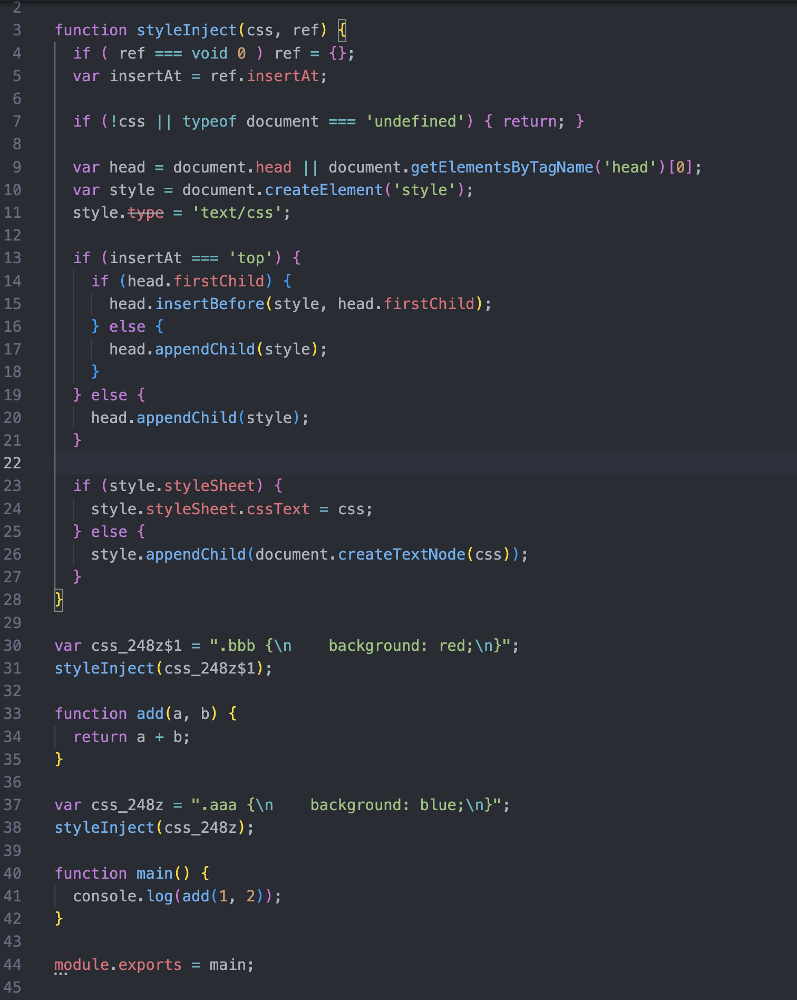

# 为什么组件库打包用rollup而不是webpack

[原文](https://mp.weixin.qq.com/s/j32uTAdbOH-7Y6144iq6aw)

## 打包产物对比

### rollup

```js
/** @type {import("rollup").RollupOptions} */
export default {
    input: 'src/index.js',
    output: [
        {
            file: 'dist/esm.js',
            format: 'esm'
        },
        {
            file: 'dist/cjs.js',
            format: "cjs"
        },
        {
            file: 'dist/umd.js',
            name: 'Guang',
            format: "umd"
        }
    ]
};
```

我们指定产物的模块规范有 es module、commonjs、umd 三种。

umd 是挂在全局变量上，还要指定一个全局变量的 name。

上面的 @type 是 jsdoc 的语法，也就是 ts 支持的在 js 里声明类型的方式。


#### 结果

```
npx rollup -c rollup.config.mjs
```

产物：


三种模块规范的产物都没问题。


### webpack

`webpack.config.mjs`

```js
import path from 'node:path';

/** @type {import("webpack").Configuration} */
export default {
    entry: './src/index.js',
    mode: 'development',
    devtool: false,
    output: {
        path: path.resolve(import.meta.dirname, 'dist2'),
        filename: 'bundle.js',
    }
};
```
打包后，webpack会多出一些runtime代码，比如 `code split`的代码，这样就导致打包产物不纯粹了


#### 构建结果


#### 浏览器加载

`import()`引入的模块，会被单独打包成一个`chunk`，在运行时会在执行到这个模块时，异步加载


## 结论

webpack 是为了浏览器打包而生的，而 rollup 一般用于 js 库的打包。


## antd打包

```sh
npm install --no-save antd
```

有个小细节，`--no-save`可以仅把三方包下载到`node_modules`下，不写入`package.json`

### 打包JS

在 node_modules 下可以看到它分了 `dist、es、lib` 三个目录

`lib/ commonjs`：


`es/ es module`:


`dist/ umd`:


### 打包CSS

安装处理CSS插件

```sh
npm install --save-dev rollup-plugin-postcss
```

添加CSS插件配置

```js
/** @type {import("rollup").RollupOptions} */
export default {
    input: 'src/index.js',
    output: [
        {
            file: 'dist/esm.js',
            format: 'esm'
        },
        {
            file: 'dist/cjs.js',
            format: "cjs"
        },
        {
            file: 'dist/umd.js',
            name: 'Guang',
            format: "umd"
        }
    ],
    plugins: [
        postcss({
            extract: true,
            extract: "index.css",
        })
    ]
};
```

构建结果中，js文件中的css引用被`tree sharking`掉了 参考：[cjs](./rollup/rollup-test/dist/cjs.js);

这样就可以单独打包js 和 css了

---

我们看看不抽离CSS的效果

```js
plugins: [
    postcss({
        // extract: true,
        // extract: "index.css",
    })
]
```

构建后的结果中，多出了 `styleInject`方法，用于动态插入css

