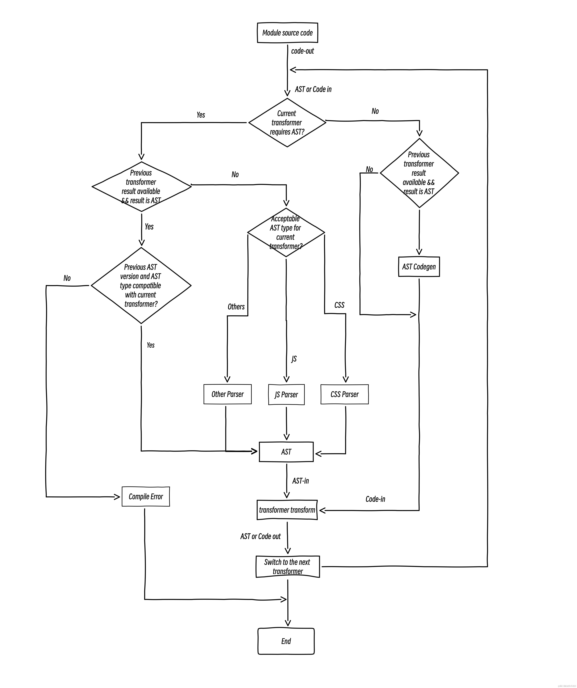

# 业界干活

## 关于Rust在构建工具领域的应用

[Bundler的设计取舍](https://github.com/orgs/web-infra-dev/discussions/4)

### webpack的使用

#### 构建性能优化

- 各种loader：`swc-loader` `esbuild-loader` `thread-loader` `cache-loader`

- [MFSU](https://umijs.org/docs/guides/mfsu) 一种基于`Module Federation`的打包方案，据说比vite还快。是由`UmiJS`提供

- `Persistent Cache` 持久化缓存 ，第一次听说，也是`webpack5`支持的能力

#### 缺点

- 黑盒

- 性能瓶颈 

如 `Persistent Cache` 依赖业务配置良好的 [build dependencies](https://webpack.js.org/configuration/cache/#cachebuilddependencies)

`esbuild-loader` 不支持 `es5` 的降级

`cache-loader` 忘记清理 `cache` 导致产物没更新。

#### 解决方案

社区流行的「双引擎」方案，即上层框架统一的配置和插件，底层的引擎可以在webpack和vite之间切换。虽然解决一部分问题，但也存在挑战：

- 插件跨引擎复用，`rollup`和`webpack`插件机制不同

- vite在大型项目中表现不理想，首屏模块多的情况下，会有大量请求带来巨大的性能开销

- Rollup 的产物优化能力较弱？缺少`Bundle Splitting`？导致无法做精细优化。所以有些业务是dev环境用vite，生产环境用webpack....

#### 提到关于rollup

优点：产物极其干净，Treesharking 友好

缺点：

- `CommonJS`的支持，rollup目前的架构，无法对CommonJS完全兼容 [rollup commonjs options](https://github.com/rollup/plugins/tree/master/packages/commonjs#options)，(可以补充一些更详细的文档)

- 羸弱的编译性能，本身和webapck类似，都是使用Js实现Bundler，所以性能差不多。但是rollup不支持`Persistent Cache`，所以2次冷启动比webpack更差。
其次不支持`HMR`，但在library库场景下需要watch，但watch性能一般

#### 关于esbuild

`esbuild`很好的解决了`rollup`的两个缺点。

`esbuild` 把`CommonJS`当做一等公民，所以对于`CommonJS`有着比较完美的支持。

`esbuild` 算是 `rollup`比较合适的替代品，在库构建场景比较合适。[tsup](https://github.com/egoist/tsup)(底层`esbuild`)，是[tsdx](https://github.com/jaredpalmer/tsdx)(底层`rollup`)的替代品

[module-tools](https://modernjs.dev/module-tools/)底层也是`esbuild`

##### 关于esbuild的问题

虽然它解决了`rollup`的`CommonJS`和性能问题两个大问题，但是在应用构建领域也存在很多问题。

- 插件化问题：`esbuild`的Api极为精简，应用构建需要更强的插件扩展能力，显然它无法满足。如缺失 onTransform hook 导致不同 transform 的扩展组合很难进行（如 sass -> postcss -> css），你只能将所有的 transform 逻辑写到一个 onLoad hook 里，这其实极难扩展，

- 产物性能问题：`esbuild` 缺乏像 `webpack` 对 `chunk` 的深度定制的能力，可能会导致chunk过多，影响加载性能

- `rebuild`问题：esbuild 的冷启动性能虽然十分优异，但是当你使用较多的 JS 插件后，其实rebuild 的性能就变得堪忧，原因在于不同于 webpack 的 loader，webpack 在 rebuild 的时候只会触发变动模块的 Loader 的重复执行，而 esbuild 则会无条件对所有的 onLoad 和onResolve 触发 rebuild，这在大型项目上其实是个O(n)的复杂度（n 为模块数目），因此rebuild 性能难以得到保障

- `HMR` 问题：本身不支持`HMR`

- Runtime 的扩展问题： 这也和 HMR 问题存在一定的相关性，另一个问题是这导致在 esbuild 上很难做到和 webpack 一样的 Module Federation 支持。

### 插件 API 的设计

`Rust bundler`设计核心就是可以使用`JS`来写`Plugin`插件。其中的核心问题是性能和可组合性。

#### 模块转换

`Bundler`插件功能的核心都是模块转换，`Rollup`是`transform`，`Webpack`是`loader`

模块转换的功能，实际上发现这实际上是三个维度的需求:

- 过滤器（filter）: 即过滤哪些模块进行转换。

- 转换器（transformer）: 即对过滤模块进行怎样的转换。

- 模块类型转换（change module type）: 即我们可能需要将一个模块从A类型转换成B类型。

##### svgr插件

一个示例，说明模块转换的复杂。`svgr`是`svg`文件转`react`组件的插件，提炼以下三个要素：

- 过滤器（`filter`）: 即 `/.svg$/`，只处理 `svg` 结尾的文件

- 转换器:即通过 `@svgr/core` 将 `svg` 内容转换为对应的 `jsx` 组件

- 模块转换: 处理完转换后，我们需要将 `svg` 的内容视为 `jsx` 来处理


关于市面上的模块转换插件方案：[web-infra-dev/rspack#315 ](https://github.com/web-infra-dev/rspack/discussions/315)

只有`Parcel`和`webpack`有较好的实现。

##### Parcel

- 过滤器：用 `pipeline` 来定义过滤逻辑

```json
{
  "transformers": {
    "icons/*.svg": ["@company/parcel-transformer-svg-icons", "..."],
    "*.svg": ["@parcel/transformer-svg"]
  }
}
```

- 转换器：使用 [transform plugin](https://parceljs.org/plugin-system/transformer#transforming-assets) 来定义转换逻辑

```js
import {Transformer} from '@parcel/plugin';

export default new Transformer({
  async transform({asset}) {
    // Retrieve the asset's source code and source map.
    let source = await asset.getCode();
    let sourceMap = await asset.getMap();

    // Run it through some compiler, and set the results 
    // on the asset.
    let {code, map} = compile(source, sourceMap);
    asset.setCode(code);
    asset.setMap(map);

    // Return the asset
    return [asset];
  }
});
```

- 模块类型转换：使用 `asset.type = xxx` 来修改模块类型

```js
import {Transformer} from '@parcel/plugin';

export default new Transformer({
  async transform({asset}) {
    let code = await asset.getCode();

    let result = compile(code);
    asset.type = 'js'; // change asset type
    asset.setCode(result);

    return [asset];
  }
});
```

##### Webpack

- 过滤器，`rule.test`

```js
module: {
  rules: {
    test: /.svgr/,
    use: ['@svgr/webpack']
  }
}
```

- 转换器, `@svgr/webpack loader`

- 类型转换， [inlineMatchResource](https://webpack.js.org/api/loaders/#inline-matchresource)（inlineMatchResource 相比于直接修改 asset.type，直观度差了很多，虽然有一个 更直观的 [virtual resource](https://github.com/webpack/webpack/pull/15459) 的提案，但是迟迟未推进）


#### AST复用

另一个性能瓶颈是`AST`的`parse`，如果在不同的模块转换中间可以复用`AST`，可以大大优化性能。

##### Esbuild

esbuild的处理方式最为直接，不支持模块转换操作，因此就不存在AST的复用问题，esbuild的`parse、transform和minify`都是共享同一个`AST`的，这也是esbuild的性能远远快于其他所有bundler的一个重要原因，缺点很明显扩展性很差

#### Rollup

rollup可以在 `load` 和 `transform hook`里返回`AST`，这里要求的`AST`是标准的 [ESTree AST](https://github.com/estree/estree/blob/master/es2025.md)，如果返回了标准的`ESTree AST`那么内部的`parse`就可以复用返回的AST避免重复`parse`。

> Note:

> rollup在复用AST的一大优势是rollup只支持JavaScript，这意味着只需要考虑标准ESTree AST一种数据结构即可，但是这对于 Parcel和 Webpack却不适用。

#### Parcel

Parcel的`transform plugin`显然是经过深思熟虑的，[Reusing ASTs](https://parceljs.org/plugin-system/transformer/#reusing-asts) 里详细讲述了如何实现AST的复用，Rspack的早期版本也也借鉴了该设计。Parcel的设计里解决了 AST的复用的一大难题，即如何处理string transform和 AST transform交叉的场景，对于一般的 transformer 实际存在四种情况。即 `string -> string, string -> AST, AST -> AST, AST -> string`,如何处理这些transformer的交叉执行是个难题，但是 Parcel 很好的解决了该难题。




#### Webpack

webpack同样支持在loader里返回AST 来支持AST的复用，但是 webpack这里存在几个限制导致这个功能在社区并没流行起来

- webpack里返回的AST只能是符合ESTree标准的AST。社区的各种JS转换的loader返回的基本都不是标准的ESTree AST，包括 `babel-loader`([babel/babel-loader#539](https://github.com/babel/babel-loader/issues/539)) 和 `swc-loader`(https://github.com/webpack/webpack/issues/13425)， 这也导致即使其返回了AST，也难以在 Webpack 里进行复用

- webpack 虽然内部 parser 支持多种AST(CSS AST和 JavaScript AST)，但是 webpack 目前也只支持JavaScript的AST，这导致虽然 Webpack 支持这个功能很长时间，但是其实也没有大规模应用

### Webpack 之路的探索

因此在未来 `Rspack` 考虑放弃对 `ts、tsx、jsx` 等模块的一等公民支持，而让用户通过 `swc-loader` 来进行编译处理，这保证了一等公民的处理和 Webpack 对齐，同时保障核心层的稳定

### Beyond Webpack

- 开箱即用

- 提升调试体验

- 优化：虽然 Webpack 对于产物的优化已经算是同类的佼佼者，但是仍然存在着不少的优化空间，如 Webpack 的 `bundle spliting | code splitting | tree shaking` 都是模块粒度的，这限制了很多的优化方式，我们未来会探索基于 `function` 粒度的优化手段，来进一步优化产物的运行时性能。

- `Portable cache + Remote build cache`