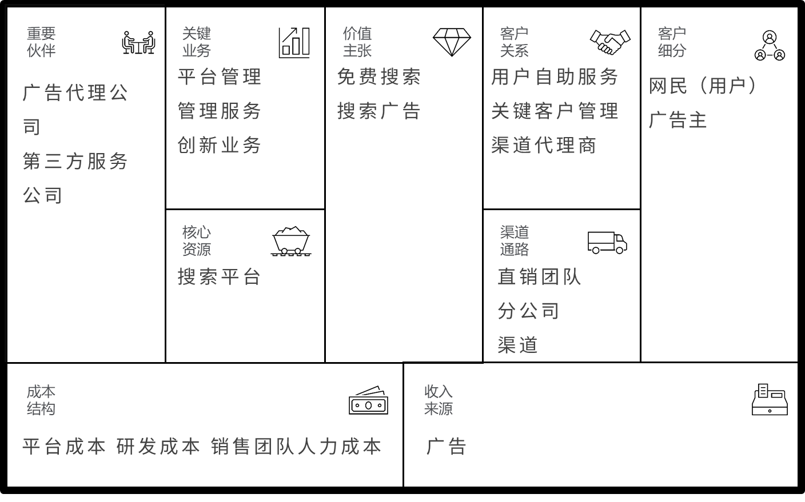
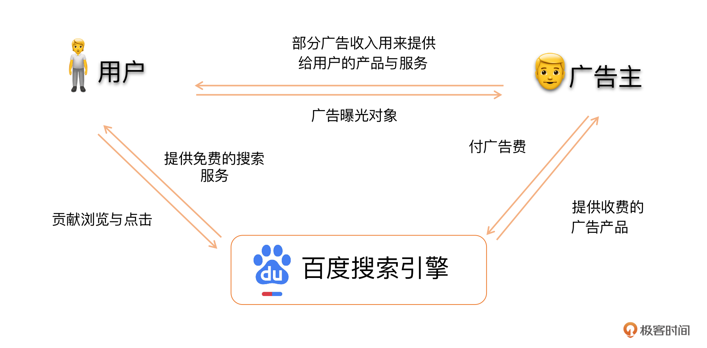
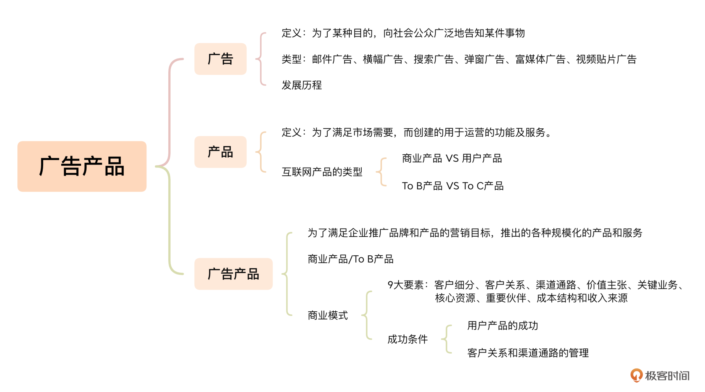
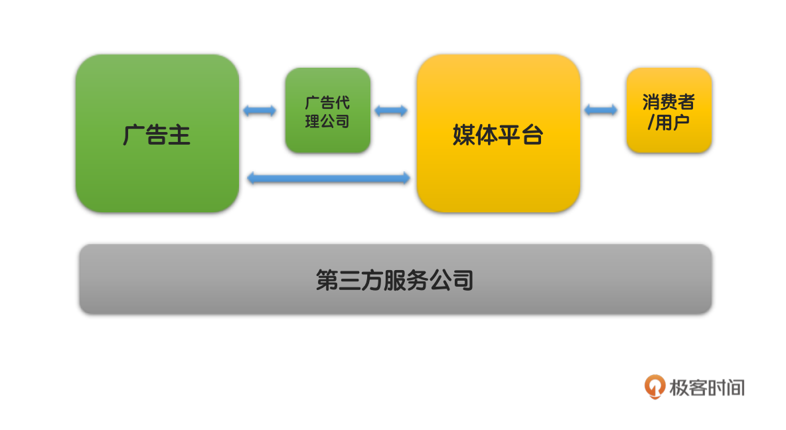
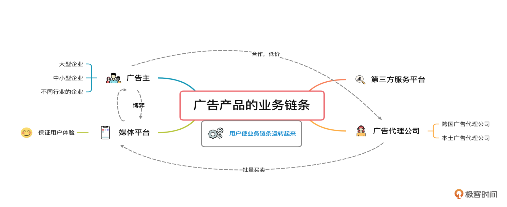
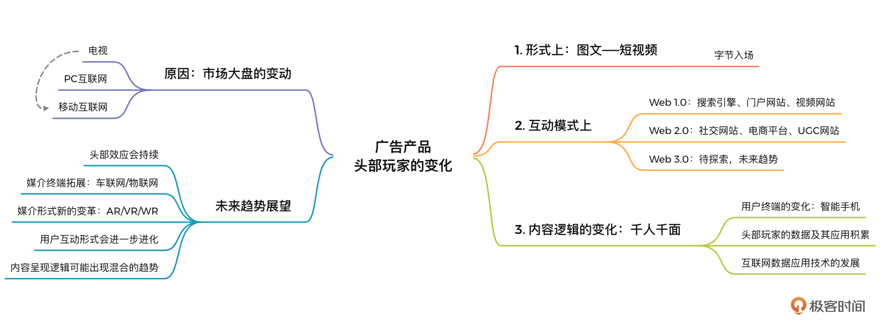
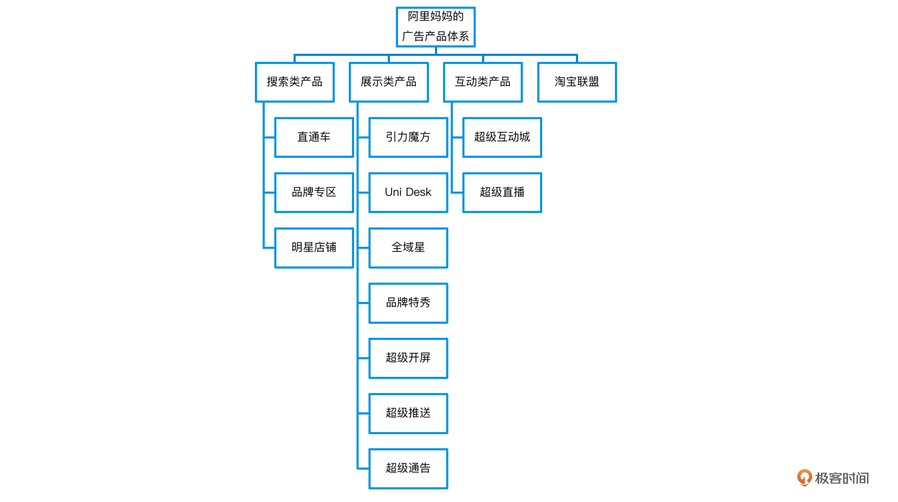
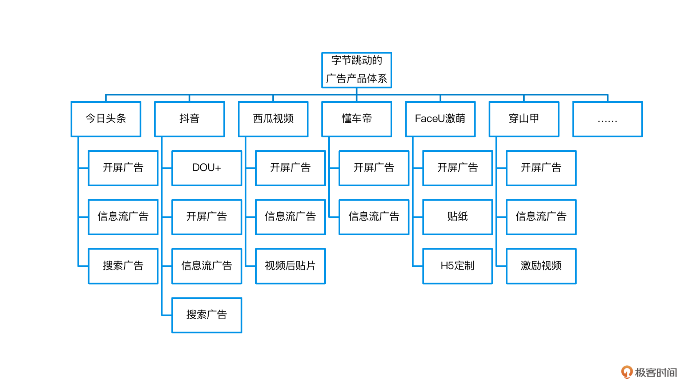

# 业务逻辑

关于盈利的商业广告

在PC时代包括：邮件、横幅、按钮、搜索、弹窗、富媒体、视频贴片 广告

## 广告产品

### 关于产品

- 产品是为了满足市场需要，而创建的用于运营的功能及服务。

- 产品是以使用为目的物品和服务的综合体。

- 产品的价值是由用户来衡量的。

### 广告商业模式

商业模式描述了一个企业是怎样创造价值、传递价值和获取价值的。

商业模式的9个关键要素分别是客户细分、客户关系、渠道通路、价值主张、关键业务、核心资源、重要伙伴，还有成本结构和收入来源。

百度搜索广告产品的商业模式：「双边平台商业模式」

这个例子中，百度至少搭建了一个双边的平台，一边是个人用户，一边是广告主。百度首先为个人用户提供了免费的搜索引擎服务，吸引了大量用户。广告主为了向大量用户便捷、高效地投放广告，选择了百度。而广告主付给百度的广告费用，其中一部分又被百度用来改进以及持续为个人用户提供免费的搜索服务。

#### 广告产品的成功秘诀一：用户产品的成功

值得思考的两个问题：

1. 你们靠什么样的用户产品去吸引用户？

2. 如果没有用户，你们的广告产品有什么优势去吸引广告主？

如果没有足够优秀的用户产品，那么就没有开发广告产品的条件。

但如果你的用户产品足够好，即使你没有广告产品，也会有很多企业蜂拥而至央求着你去开发广告产品的。

成功的广告产品离不开成功的用户产品。那些能够在广告行业的业务链条中获取最多收益的公司，都是像谷歌、facebook、腾讯、字节跳动这样拥有着海量流量的用户产品的公司。

#### 广告产品的成功秘诀二：客户关系和渠道通路的管理

1. 广告产品属于ToB产品，广告主是「企业客户」，作为一个大企业来说对于广告购买和投放有着繁琐的流程，所以需要广告平台团队有专门的销售团队来处理沟通、协调和推进的问题。

2. 对于「中小商家」，由于数量成千上万，所以不可能通过销售团队来一一沟通，所以需要「渠道代理商」做触达和引导

因此，销售费用，在广告这一商业模式中，是一种必不可少的成本支出。而如何打造一个成功的销售体系，并推动广告产品的发展而不断进化与适应，也是一个广告产品能否成功以及可持续发展的关键因素之一

## 总结

# 业务链条

广告主、媒体、第三方等分别如何看待广告产品？

业务链条包括：

- 业务涉及的各方

- 各个不同角色的立场和需求

- 角色间的金钱、数据以及其他事物的流转

## 广告主

广告主是广告产品的最终需求方。他们为了向目标消费者推广自己的品牌和产品信息，向媒体平台购买广告产品，通过这些媒体平台向消费者投放广告

### 大企业

用户量大、位置显眼、尺寸大一般针对的是大企业的广告主，比如抖音的开屏广告。

除了移动端开屏广告之外，还有富媒体广告、视频贴片公共

### 中小型企业

相对于大企业，他们更看重「广告的边际效果」，就是广告能不能给他们带来营收和利润，针对这些广告主，广告产品主要考虑**效果指标**

比如搜索关键词竞价广告，对于中小企业是既经济又实惠。比如像百度、谷歌等以搜索服务为主要产品的公司

下面这段是啥意思 ??
> 大型企业在效果广告上的投放比例也越来越高了。但和中小型企业不同，大型企业购买搜索关键词竞价广告，很多情况下是作为对于自身品牌和产品的公关保护手段。

### 媒体平台

它是用户和广告主的中介，既需要考虑如何为公司带来更多商业价值，又需要考虑如何平衡用户体验。

从为公司带来更多商业价值的角度来说，采取直接和广告主进行销售金额分成，对平台来说是很不利的，根本原因是：我们控制不了从广告投放到用户购买广告主商品的整个过程。

大的媒体都不接受这种销售金额分成的广告产品购买形式，小一点的平台可能会为了得到广告主的青睐而选择。但广告主也要优先保证自己的品牌和产品的推广力度，所以如果有购买力，也会优先选择打的媒体平台。所以从根本来说，这是双方的一种博弈

## 广告代理公司

就是作为广告主的代表，来和媒体平台打交道，进行广告产品的采购和投放的公司。

中国境内的一般可以分为：

- 跨国广告代理公司

一般被称为「4A」。是“美国广告协会”The American Association of Advertising Agencies的缩写，在国内逐渐成为外资广告公司的统一简称。

- 本土广告代理公司

### 广告代理公司如何帮助广告主更划算的购买广告产品？

媒体平台有批量售卖广告的策略，买的越多价格越便宜，所以有些有实力的广告代理公司会把多个广告主的需求捆绑在一起，集中像媒体平台购买，从而获得更大力度的优惠。

因为广告产品具有限时性，所以没办法压库存。某个时段卖出不去就浪费了，所以媒体平台为了鼓励大量批发。比如给广告代理公司五折采买，广告主直接采买六折，所以可能选择广告代理公司成本更加合适。

除了集中采购之外，还会为广告主提供一系列的服务，例如收集整理媒体平台的广告产品信息，给广告主出营销方案，走合同等等。

**广告代理公司的立场，介于广告主和媒体平台之间**。因为他们除了服务广告主，也要和大的媒体平台保持良好的关系

## 第三方服务公司

不属于广告主、广告代理、还是媒体平台中的任何一个角色。

比如典型的广告数据检测公司。在媒体平台提供的广告曝光、点击等效果数据之外，广告主还会出于自身立场和审计需求，找第三方广告数据监控公司来进行数据检测。

## 总结

# 头部玩家

从BAT到跳动的字节，广告产品有哪些变化与发展趋势？

# 产品体系

互联网大厂的广告产品存在哪些共性和区别？

## 体系特点

头部玩家的广告产品体系，一般包含「自有流量上的广告产品线」 和 「站外合作广告产品线」两大类

### 体系一：自有 + 外部

自有流量平台的广告产品由于其高效的流量利用率和较高的广告效果，是广告主的首选。

但由于自有流量有上限，优质资源供不应求，所以需要拓展外部流量池，增加广告供给，满足广告主需求。

市面上大型的外部合作的联盟类广告产品平台，也都是头部玩家搭建的。

### 体系二：按与用户的互动关系分类

- 搜索类广告

- 展示类广告

- 互动类广告

# 变现模式

什么样的产品适合采用广告模式变现？