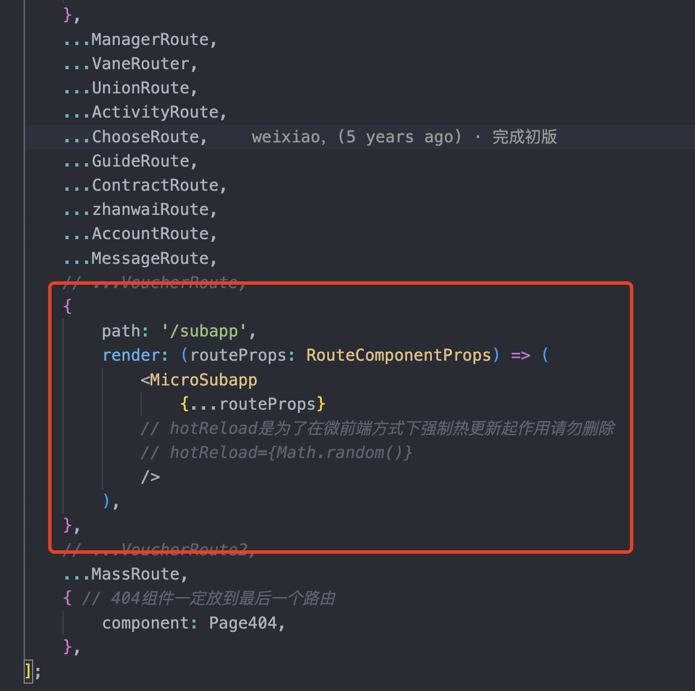

# 微前端

这里写一种设计较简单的微前端思路，不区分多技术栈，基座、子项目统一使用`react`，子项目加载通过动态路由实现。

## 架构设计

### 子项目的注册

意思就是当路由匹配到子项目，此时通过动态路由`react-router`去加载对应的子项目，那么当子项目加载完成，怎么通知基座，也就是说基座项目怎么感知子项目的加载完成。

这里有一种解决方案，是通过设置子项目webpack打包成`jsonp`形式来实现。具体`webpack`配置：

 `webpack.output.libraryTarget: jsonp`，`webpack.output.library: 'loadSupApp'`

> 这里有[webpack官网api](https://webpack.js.org/configuration/output/#other-targets)

通过将子项目构建成`jsonp`形式包 `MyLibrary(_entry_return_);` ，也就是 `loadSupApp(module)`。

这里的`loadSupApp`是一个全局方法，定义在基座项目里面类似这样：

```js
// 基座工程

const registerMap = {}; // 子项目注册列表

window.loadSupApp = (module) => {
    registerMap.subAppKey = module;
}
```

---

## 整体设计

拆成基座和子项目两部分

基座：

- 路由切换

- 注册加载子项目

- 全局store，全局库，通用功能注册

子项目：

- 业务功能

- 具备独立发布部署

## 动态路由

### 基座

基座使用 react-router 实现，以 /subapp 前缀来区分子项目

命中子项目后渲染 MicroSubapp 组件，同时将路由参数一并传入



### 子项目

## 动态Store

## 动态CSS

## 复用能力

## 流程部署

