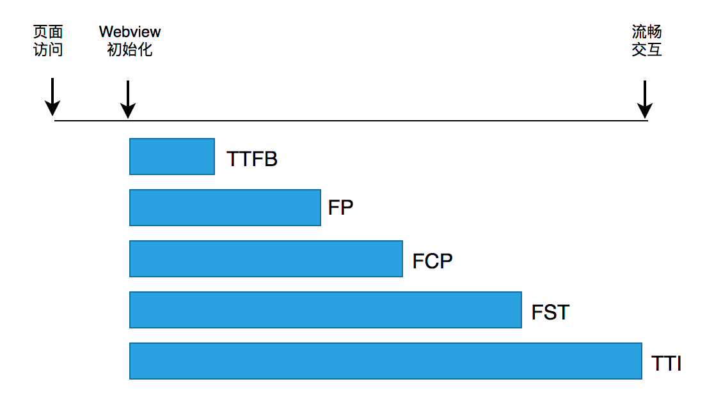
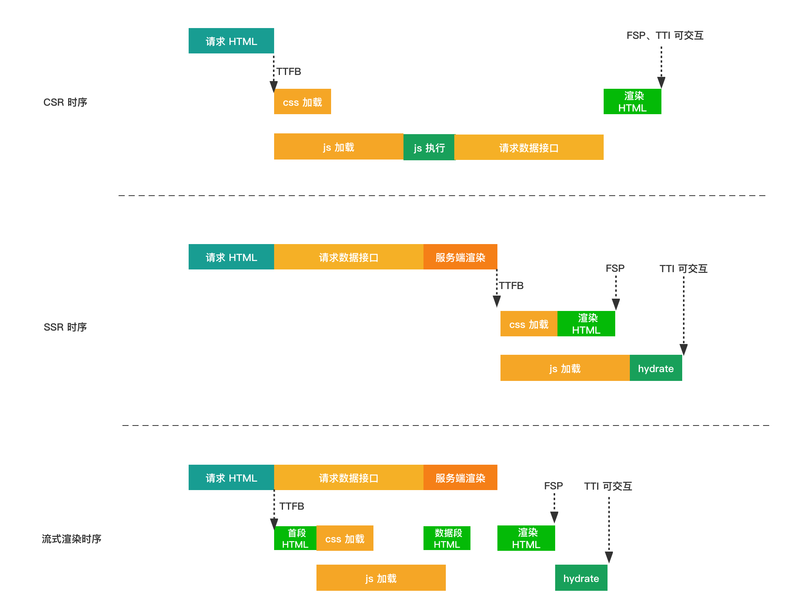

# 性能衡量指标

## 页面性能指标

- TTFB（Time to First Byte） 第一个字节的时间 - 从点击链接到收到第一个字节内容的时间

- FP（First Paint） 首次绘制 - 用户第一次看到任何像素内容的时间

- FCP（First Contentful Paint） 首次内容绘制 - 用户第一次看到有效内容的时间

- FSP（Firs Screen Paint） 首屏内容绘制 - 用户看到第一屏内容的时间

- LCP（Largest Contentful Paint） 最大内容绘制 - 用户看到最大内容的时间

- TTI（Time to Interactive）可交互时间 - 用户与页面可交互的时间（比如可响应事件等）

## 机器指标

- QPS 每秒查询数

- RPS 每秒请求数

- 资源利用率

# 时序

## ssr 流式渲染

原理：HTTP1.1中支持的分块传输协议（Chunked Transfer Encoding）。参考：[分块传输编码](https://zh.wikipedia.org/wiki/%E5%88%86%E5%9D%97%E4%BC%A0%E8%BE%93%E7%BC%96%E7%A0%81?spm=taofed.bloginfo.blog.3.23615ac8iJwqPw)