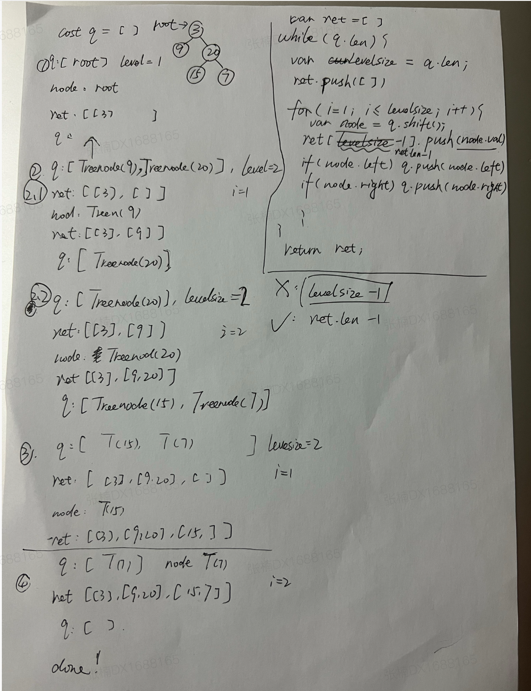

# 树数据结构

## 定义

- 根root

- 子树subtree

- 节点node 树中的元素

- 双亲parent

- 度 degree 节点的子树个数

- 叶子leaf 度为0的节点

- 层级level 根为第一层，其余节点的层级等于其双亲节点的层级+1

## 二叉树和森林

每个节点最多只有两个子树的结构。通常称子树为“左子树”，“右子树”


## 二叉树性质

1. 在二叉树的第i层上至多有个节点（i>=1）
2. 深度为k的二叉树至多有个节点（k>=1）
3. 对于任意一棵二叉树，如果其叶节点个数为n0，度为2的节点个数为n2，则n0=n2+1
4. 具有n个节点的完全二叉树的深度为log2n+1
5. 对于具有n个节点的完全二叉树，如果按照从上至下从左至右的顺序对节点进行编号，则对于序号为i的节点有：
    - 如果i>1，则双亲序号为i/2
    - 如果2i<=n，则左孩子序号为2i
    - 如果2i+1<=n，则右孩子序号为2i+1

### 二叉树常见算法

#### 深度优先遍历 DFS 

先左子树，后右子树

每个节点都经历**3**次遍历，N叉树就是N+1次遍历

按照第一次访问节点顺序遍历，就是**先序遍历**，根左右

按照第二次访问节点顺序遍历，就是**中序遍历**，左根右

按照第三次访问节点顺序遍历，就是**后序遍历**，左右根

[前序 leecode 144](https://leetcode.cn/problems/binary-tree-preorder-traversal/)

[中序 leecode 94](https://leetcode.cn/problems/binary-tree-inorder-traversal/)

[后序 leecode 145](https://leetcode.cn/problems/binary-tree-postorder-traversal/)


#### 广度优先遍历 BFS

从上至下，从左至右遍历

[层序遍历 leecode 102](https://leetcode.cn/problems/binary-tree-level-order-traversal/))

思路如下：

1. 创建一个队列，用于存储节点。

2. 将根节点加入队列。

3. 当队列不为空时，进行以下操作：
- 获取当前队列的长度，表示当前层的节点数。
- 创建一个空列表，用于存储当前层的节点值。
- 遍历当前层的所有节点：
    - 从队列中取出一个节点，加入当前层的列表。
    - 如果该节点有左子节点，将左子节点加入队列。
    - 如果该节点有右子节点，将右子节点加入队列。
    - 将当前层的列表加入结果列表。

4. 返回结果列表。

```js
/**
 * Definition for a binary tree node.
 * function TreeNode(val, left, right) {
 *     this.val = (val===undefined ? 0 : val)
 *     this.left = (left===undefined ? null : left)
 *     this.right = (right===undefined ? null : right)
 * }
 */
/**
 * @param {TreeNode} root
 * @return {number[][]}
 */
var levelOrder = function(root) {
    const ret = [];
    if (!root) {
        return ret;
    }

    const q = [];
    q.push(root);
    while (q.length !== 0) {
        const currentLevelSize = q.length;
        ret.push([]);
        for (let i = 1; i <= currentLevelSize; ++i) {
            const node = q.shift();
            ret[ret.length - 1].push(node.val);
            if (node.left) q.push(node.left);
            if (node.right) q.push(node.right);
        }
    }
        
    return ret;
};
```

逐步分析：

```js
// 定义二叉树节点
function TreeNode(val, left, right) {
  this.val = (val === undefined ? 0 : val);
  this.left = (left === undefined ? null : left);
  this.right = (right === undefined ? null : right);
}

// 创建一个示例二叉树
//      1
//     / \
//    2   3
//   / \   \
//  4   5   6
const root = new TreeNode(1);
root.left = new TreeNode(2);
root.right = new TreeNode(3);
root.left.left = new TreeNode(4);
root.left.right = new TreeNode(5);
root.right.right = new TreeNode(6);

// 调用层序遍历函数
const result = levelOrder(root);
console.log(result); // 输出 [[1], [2, 3], [4, 5, 6]]

```

