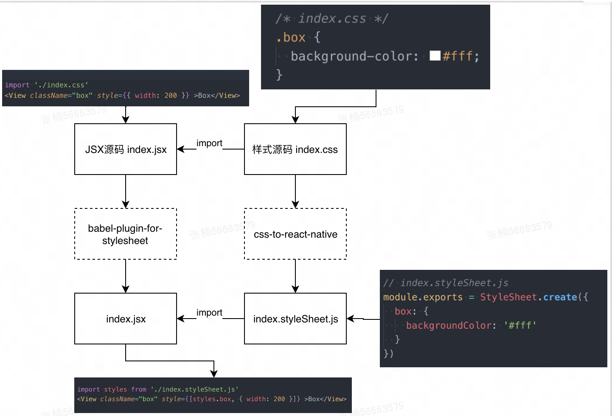
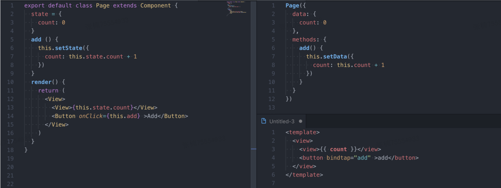

# 是什么

以下用“rtx”代表ReactToX

一款容器无关框架，一套代码多端复用。支持RN,Webview，小程序，Flutter

## 业界竞品

- mpvue 美团

- wepy 腾讯

- Chameleon 滴滴

- Taro 京东

## 使用

全局安装cli

```
yarn global add @rtx/cli
```

初始化项目

```
rtx init
```

顾`rtx`项目支持`cli`脚手架能力，来初始化工程应用。


# 原理

## 结构预览

### 运行时

- @rtx/rtx 运行时框架

- @rtx/rtx-h5  h5运行时框架

- @rtx/rtx-weapp WX小程序运行时框架

- @rtx/rtx-mrn mrn运行时框架

- @rtx/router 路由

- @rtx/router-mrn mrn路由

- @rtx/components 基础组件库

- @rtx/components-mrn 基础组件库

- @rtx/async-await 请求库

- @rtx/utils 工具包
 
### 编译时

- @rtx/cli 开发工具

- @rtx/transformer-x ? 各端 转换工具

- @rtx/webpack-runner h5 webpack 编译工具

- @rtx/rtx-plugin-babel 编译插件

- @rtx/rtx-plugin-css/less/scss/stylus css编译插件

- @rtx/rtx-plugin-typescript ts编译插件

- @rtx/rtx-plugin-uglifyjs 压缩编译插件

- @rtx/postcss-pxtransform 单位编译插件

- @rtx/babel-plugin-transform-api 编译插件

### 其他

- @rtx/eslint-config-rtx

- @rtx/eslint-plugin-rtx

## 组件和API的设计和适配

rtx的目的就是一套代码多端运行，但是多端上的差异，需要设计一套统一的标准规范来抹平。

### 多端差异

#### 组件（标签）差异

- h5标签采用XML写法，类似标签有 `<div>` `<span>`等

- 小程序采用WXML（WeiXin Markup Language）标签语言，同时也有完整的基础组件，但和h5差异较大

- ReactNative 采用JSX，有自己的一套基础组件，和h5 小程序也截然不同

#### API差异

- 接口差异：在不同端中都提供了相同或近似的功能，但实现方式以及调用参数可能存在极大差异。比如数据缓存`Storage`，小程序中`wx.setStorage/wx.setStorageAsync`，h5中`localStorage.setItem`，RN中`AsyncStorage,setItem`

- 容器差异：各个端提供的API都是各自的容器定制的，比如小程序的用户接口类API、广告类API，完全是针对小程序所处的微信环境打造的

- 能力差异：并不是所有功能点在各个端上都可以适配实现，就比如h5中就无法像在小程序或RN中使用文件读取能力，这一类差异性在适配过程中都属于不可抗拒，不可抹平的差异

#### 样式差异

小程序的wxss和h5 css在参数属性上几乎一致，但在层级关系上有很大差别，小程序分为全局样式和局部样式，各个组件间的样式也是不会互相影响。

RN采用的是`StyleSheet`是用`inline style`的方式，不支持全局样式，而且属性限制诸多，比如只能使用Flex布局等。


### 如何适配

封装组件库和API，对于端能力限制的功能进行了一定取舍，对高优功能进行了SDK底层适配

#### 组件适配

##### **h5 对齐 DSL**

```js
// 小程序基础组件view
<view class="wrapper" style="width: 20px" hover-class="hover">children</view>

// 对应的h5 React封装的组件类似这样
<View className="wrapper" hoverClass="hover" style={{width: '20px'}}></View>
```

可以这样实现

```js

class View extends React.Component {
  state = {
    hover: false,
  }
  
  onTouchStart = e => {
    if (this.props.hoverClass) {
      this.setState({
        hover: true
      })
    }
  }
​
  onTouchEnd = e => {
    if (this.props.hoverClass) {
      this.setState({
        hover: false
      })
    }
  }
​
  render() {
    const { hover } = this.state
    const { className, hoverClass, style } = this.props
    return (
      <div
        className={`${className} ${hover ? hoverClass : ''}`}
        style={style}
        onTouchStart={this.onTouchStart}
        onTouchEnd={this.onTouchEnd}
      >
         {children}
      </div>
    )
  }
}
 
```

##### **RN 对齐 DSL**

分成两部分：JS适配和SDK适配

1. JS适配

情况1：一部分属性、方法是共有的，且命名相同，可以直接复用。如：

`Slider`组件属性：step(步长)，disabled(禁用)

情况2：功能实现，但是对外暴漏的属性名或方法名不统一，这部分只需要做简单封装，保证对外名称一致即可

| 组件名 | RN | 小程序 | 描述 |
| ----- | ----- | ----- | ----- |
| Switch | value | checked | 是否选中 |
| Switch | onValueChange | bindchange | 选中值发生改变时调用 |

...

情况三：一分部功能，小程序实现，但是RN未实现，这种情况需要定制化实现，达到对齐目的。举例：

微信小程序的button组件支持loading属性（名称前是否带 loading 图标），像这样的功能我们需要在<TouchableOpacity>中嵌入一个<Animated.View>动画标签和一个带着loading的<Image>标签来对齐小程序loading相同的功能。

```js
{loading && (
            <Animated.View
              style={[styles.loading, { transform: [{ rotate: rotateDeg }] }]}
            >
              <Image
                source={type === 'warn' ? require('../../assets/loading-warn.png') : require('../../assets/loading.png')}
                style={styles.loadingImg}
              />
            </Animated.View>)
          }

```

#### SDK适配

一些场景会用到native的能力，比如音视频类组件、webview组件，这种情况会封装成统一SDK，达到多端一致的目的。

除了对组件支持之外，还支持部分业务相关`桥`的封装，比如埋点上报的公共参数，业务相关的特定参数传递等，通过桥传递来抹平业务差异

总结：

小程序和RN的适配分两部分，第一部分是native组件和桥的封装，第二部分是Js端对js组件的二次封装。通过这两种方式抹平了RN和小程序之间的差异。


#### 样式适配

- 小程序和h5差异不大，可以通过postcss将样式单位进行转换，将**px**转成**rem/rpx**

- 针对RN，则是将CSS样式编译成`StyleSheet`文件，再将引入的`index.css`替换成`index.stylesheet.js`



下面是编译后的样例：

```js
import { View } from '@rtx/component';
import './index.css'
<View
  className="box"
  hoverClass="hover"
  style={{ height: 300 }}
>children</View>
​
// 编译成小程序
import './index.wxss'
<view class="box" hover-class="hover" style="inlineStyle({ height: 300 })" >children</view>
​
// 编译成MRN
import { View } from '@rtx/component-rn';
import styles './index.styleSheet.js'
<View
  hoverStyle={styles.hover}
  style={[styles.box, { height: 300 }]}
>children</View>
 
```

## 路由实现

小程序有自己的路由机制，所以它可以作为参考配置结合各端功能来实现类似方案

```js
conifg = [
  pages: [
    'pages/index/a',
    'pages/index/b',
  ]
]
```


### RN路由实现

使用[React-Navigation](https://www.reactnavigation.org.cn/docs/guide-intro) ，它是一款比较成熟、功能齐全的路由库

编译后的RN代码：

```jsx
// 在入口文件 App.js 中
import RTXRouter from '@rtx/rtx-router-mrn';
import pagesIndexIndex from './pages/index/index';
import pagesTestIndex from './pages/test/index';
​
class App extends RTX.Component {
  // ...
  render() {
    return renderRootStack(this.props.screenProps)
  }
}
​
const renderRootStack = screenProps => {
  const pages = [
    ['pages/index/index', pagesIndexIndex],
    ['pages/test/index', pagesTestIndex],
  ];
  const RootStack = RTXRouter.initRouter(pages, R2X);
  return <RootStack screenProps={screenProps} />;
};
​
// RTXRouter.initRouter 的实现
function initRouter(pages, R2X) {
  let RouteConfigs = {}
  pages.forEach(v => {
    const pageKey = v[0]
    const Screen = v[1]
    RouteConfigs[pageKey] = {
      screen: getWrappedScreen(Screen, R2X)
    }
  })
  return createStackNavigator(RouteConfigs)
}
 

```

关于`navigate api`在`React Navigation`初始化时将函数挂载到`RTX`上，再对参数进行一次转换

```js
RTX.navigateTo() => this.props.navigation.push()

RTX.redirectTo() => this.props.navigation.replace()

RTX.navigateBack() => this.props.navigation.goBack()
```

### h5路由实现
‘
业界比较成熟的是`react-router`，但它属于组件级别的路由，对于h5来说有点重，所以参考它自己实现一个轻量router，同样是基于`hashchange`和`popstate`

编译后的h5代码：

```jsx
// 在入口文件 App.js 中
import { Router } from '@rtx/router';
class App extends Component {
  render() {
    return <Router 
     routes={[{
      path: '/pages/index/index',
      componentLoader: () => import( /* webpackChunkName: "index_index" */'./pages/index/index'),
      isIndex: true
    }, {
      path: '/pages/test/index',
      componentLoader: () => import( /* webpackChunkName: "test_index" */'./pages/test/index'),
    }]}   />
  }
}
 
```

## 编译和运行时结合

由于H5和RN的语法较为类型，得益于React和JSX，所以二者编译相对简单。但是小程序语法和两者差别巨大，编译难度大



差异：React中视图和js在一个文件，而小程序中视图和js是两个文件

所以整体思路就是把JSX抽离出来作为模板，再将Page类转换成Page()的配置对象

### 模板抽离

通过`AST`不断遍历，完成转换，同时处理一些小细节：

- 遍历`JSXElement`，将驼峰标签`<View>` `<ScrollView>`转为中横线小写命名`<view>` `<sroll-view>`

- 遍历`JSXAttribute`。将`onXXX={this.add}`替换成`bindXXX="add"`（onClick转bindTap要特殊处理）

### JS抽离

通过运行时手段解决，实现一个`createComponent`来对类进行封装

```js
Page(createComponent(class extends Component {
  state = {
    count: 0
  }
  add () {
    this.setState({
      count: this.state.count + 1
    })
  }
  render() {
    // 将JSX部分代码给剔除
  }
}))
 
```

上面代码中使用**匿名类**作为参数传递给`createComponent`方法。使用匿名类一般用于临时参数传递，这样处理比较简单。

`createComponent`的实现：

```js
function createComponent (ComponentClass, isPage) {
  let initData = {}
  const componentProps = filterProps(ComponentClass.defaultProps)
  const weappComponentConf = {
    data: initData,
    created (options = {}) {
      // 实例化 ComponentClass
      this.$component = new ComponentClass({}, isPage)
      this.$component._init(this)
      this.$component.render = this.$component._createData
      this.$component.__propTypes = ComponentClass.propTypes
      // 将options的参数同步到$router.params
      Object.assign(this.$component.$router.params, options)
    },
    attached () {
      // ...
    },
    ready () {
      if (!isPage && !this.$component.__mounted) {
        this.$component.__mounted = true
        componentTrigger(this.$component, 'componentDidMount')
      }
    },
    detached () {
      const component = this.$component
      componentTrigger(component, 'componentWillUnmount')
      component.hooks.forEach((hook) => {
        if (isFunction(hook.cleanup)) {
          hook.cleanup()
        }
      })
    }
  }
  if (isPage) {
    weappComponentConf.methods = weappComponentConf.methods || {}
    weappComponentConf.methods['onLoad'] = function (options = {}) {
      if (this.$component.__isReady) return
      Object.assign(this.$component.$router.params, options)
      initComponent.apply(this, [ComponentClass, isPage])
    }
    weappComponentConf.methods['onReady'] = function () {
      this.$component.__mounted = true
      componentTrigger(this.$component, 'componentDidMount')
    }
    weappComponentConf.methods['onShow'] = function () {
      componentTrigger(this.$component, 'componentDidShow')
    }
    weappComponentConf.methods['onHide'] = function () {
      componentTrigger(this.$component, 'componentDidHide')
    }
    __wxRoute && cacheDataSet(__wxRoute, ComponentClass)
  } else {
    weappComponentConf.pageLifetimes = weappComponentConf.pageLifetimes || {}
​
    weappComponentConf.pageLifetimes['show'] = function () {
      componentTrigger(this.$component, 'componentDidShow')
    }
​
    weappComponentConf.pageLifetimes['hide'] = function () {
      componentTrigger(this.$component, 'componentDidHide')
    }
​
    weappComponentConf.pageLifetimes['resize'] = function () {
      componentTrigger(this.$component, 'onResize')
    }
  }
  bindProperties(weappComponentConf, ComponentClass, isPage)
  bindBehaviors(weappComponentConf, ComponentClass)
  bindStaticFns(weappComponentConf, ComponentClass)
  bindStaticOptions(weappComponentConf, ComponentClass)
  bindMultipleSlots(weappComponentConf, ComponentClass)
  // 绑定所有事件
  ComponentClass['$$events'] && bindEvents(weappComponentConf, ComponentClass['$$events'], isPage)
  return weappComponentConf
}
​
 
```

在`createComponent`中Class实例化，并且将小程序的各个生命周期对应的去触发`React.Component`对应的生命周期，并对一些参数进行了同步，这样就可以让React代码在小程序中运行。


# 实践

## 处理差异

作为上层DSL，对于底层技术栈融合能力是有限的，所以对于一些复杂场景不可避免的需要处理多端差异

### 业务逻辑差异

利用环境变量 `process.env.RTX_ENV`判断当前编译类型，如: h5 | weapp | rn。通过这个变量来差异化处理不同端的逻辑

```js
if (process.env.RTX_ENV === 'rn') {
  // rn 逻辑
} else if (process.env.RTX_ENV === 'h5') {
  // h5 逻辑
} else if (process.env.RTX_ENV === 'weapp') {
  // 小程序逻辑
}
```