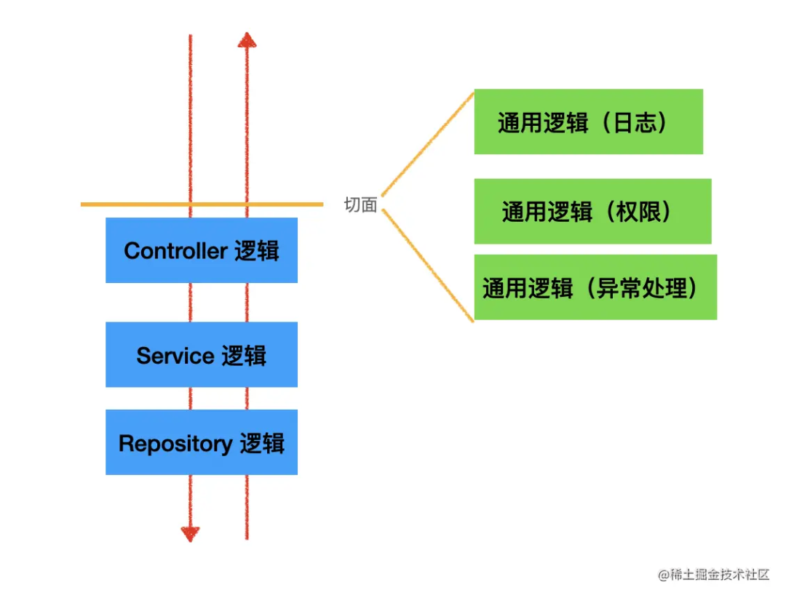

# 8-19

- 周三就篮球比赛，希望小组能赢一局

- 英语持续学习中. 今天第一节直播课

- 最近手头活多又紧迫

- 工作上有点负面情绪，有点不想在广告待着了

# 8-7

- 最近每天坚持学习英语，感觉英语读起来确实有点意思，继续加油

- 美团篮球杯又要开始了，去年基本没怎么打，到家2队的人都不认识，没啥参与感。今年和球友组了一个队，参与感有了，但我估计水平太菜，一轮可能就会被淘汰。不过我还是会尽力，万一赢个一两局呢

# 7-21

顺义这边竟然还有一个室内海洋动物园，叫亚森王国~ 今天带2个娃去了，总体还不错，遗憾就是最后一个海狮表演没有看完，娃子饿哭了...

# 7-17

- 知识付费了...准备学习下英语

- 看书可以缓解焦虑，也可以治愈自己

# 7-11

记录下最近所见所思

- 自三鹿奶粉以来，更令人震惊、愤怒、恐怖的食品安全问题，食用油、煤油混装事件。这已经是行业公开秘密，距今已经19年了，也就是在19年前，这个行业就开始出现食品安全问题...

- 最近在看「深度关系」这本心理学书，学到了一些概念，帮我认识到自己以及身边人身上的一些人性

- 技术上，对于事件机制「EventCenter」有了更深的体验，感受到了组件通信在使用事件通信设计后的便利和强大

# 6-17

之前写过一个支持多端的npm sdk，同时支持 rn web machpro 等，那么之前的设计方案是多端import方式一致，

```js
import xxx from 'npm-sdk'
```

为了一致，其实实现是比较hack的，由于rn 和 machpro 都有自己独立的包入口加载机制，rn优先读取 package.json中的 react-native配置，machpro读取根目录下的importCustom.js文件，剩下的package.json中的main入口留给web，这样“恰巧”可以满足需求，但是如果再集成进其他技术栈可能就无法满足了，除非该技术栈有自己独特的加载机制。

追起主要原因就是没有一个类似cli的东西，能在dev前，build前，前置的将import的路径自定改成对于技术栈的入口，类似这样：

```js
// rn
import xxx from 'npm-sdk/dist/rn.js'
// machpro
import xxx from 'npm-sdk/dist/machpro.js'
// web
import xxx from 'npm-sdk/dist/web.js'
```

但其实是可以这样做的，就比如可以通过写一个babel插件来实现。在引用npm包的同时，在webpack中接入我们自定义的babel插件，这样是可以解决的，但是接入成本有些高，同时，如果项目没有使用webpack，而是比如vite，那么我们就还得提供rollup的插件。

但这是一个相对就完整的解决方案。

# 6-14

今天学到了一个新的浏览器API: Beacon API（有信标的意思）

主要用于的场景：将分析数据发送给服务器，比如埋点数据

参考MDN(https://developer.mozilla.org/zh-CN/docs/Web/API/Beacon_API)


# 5-31

5月最后一天，鸟枪换炮，MAC M3 PRO

# 5-23

最近搞了半天一个监控告警问题，某人非要定位具体是哪里的问题，其他项目也都出现过一样的问题... 不过基本把`Loadjs`的源码看了一遍，然后还在它的基础上魔改了一把，感觉有点浪费时间了。

还一个事情就是埋点治理的文档，某人定一个指标，说是给其他组人看要让别人也能力理解，结果自己定的指标描述起来我感觉也是晦涩

# 5-13

- 又一次遇到多端构建的问题，包括commonjs esm 打包报错，以及头疼的ts类型问题

- 这个包是用来处理曝光检测相关的组件


# 5-6

好久没随了，记录下近期情况，五一休假陪伴娃子们5天，和他们玩很有趣，看着他们学习走路感觉很奇妙，能感受出他们智力也在发育，学习能力一点点在提高，很有趣。回到工作之后，还会想念他们~ 

# 4-7

看到一个三方库源码里有个hook的api，既可以通过对象结构`const {a,b,c} = hook()`，又可以支持数组结构`const [a,b,c] = hook()`，有点意思，写法很容易，但是看完会觉得哇，还能这么写..

```js
// hook.js

const res = [a, b, c];

res.a = res[0];
res.b = res[1];
res.c = res[2];
```

是不是很神奇，很简单，但是就没想到

# 3-20

最近工作需要了解埋点功能中关于MV模块曝光检测机制的实现，在web中除了以往我了解到的`getBoundRect`那个api之外，还有一个更好用的API：

`IntersectionObserver`，可以看[阮一峰版本](https://www.ruanyifeng.com/blog/2016/11/intersectionobserver_api.html)

# 3-3

最近读JS设计模式这本书，感觉有很多新的理解和体会

# 3-1

放下执念，要接受和包容

# 2-26

24年新年假期结束，一共休息了快一个月，在家带娃的日子还是很幸福的。还有两次10天育儿假的机会 哈哈

新一年还是得动力满满，让各个方面的压力给我形成`他律`，推着我继续进步~

# 2-5

被算法打倒的一天~

# 1-30

[3款微前端方案：qiankun、wujie、micro-app对比干货](https://juejin.cn/post/7309477710523269174)

# 1-25

[rust](https://kaisery.github.io/trpl-zh-cn/title-page.html)

# 1-24

是时候把算法数据结构捡起来了 - .-

# 1-19

React的设计理念：

```js
UI = fn(snapshot)
```

【UI渲染】 是 【数据快照】经过【函数映射】来的

- 数据快照

- 函数映射

在FP 函数式编程中，**不可变数据**更适合作为数据快照，对应着react中的`state props context`

函数映射，`ClassComponent`或`FunctionComponent`都可以作为其载体，无特殊要求

为什么函数组件更适合做函数映射呢，主要原因是可以更好控制副作用：

- useEffect：清理函数

- forwardRef：更好的防止ref滥用

- Suspense：数据请求api副作用

# 1-18

关于函数组件和函数编程的关系思考

> [参考文章](https://juejin.cn/post/7303546495777275913)

# 1-16

MT的roo组件库是真能炒啊，antd恨不得全搬过来，连demo实例代码都是一毛一样，无语。让你对标，没人你copy

# 1-15

对react表单组件库用法有点迭代，之前复杂自定义功能的校验也理解该怎么实现，但是还是得从底层原理出发理解表单设计。实现一个强大表单组件，还是很考验设计的

# 1-12

重新回到球场，感觉体力还是不足，连打3长以后，腿有点软了。今天最后一场表现异常神勇，可惜视频没有录上，果然任何事情，都会存在一些遗憾

# 1-9

关于nest和express对比的问题：

光神的：[为什么说 Nest.js 提供了 Express 没有的架构能力？](https://mp.weixin.qq.com/s/JOxWt9gtYnNcGzsvjsf0Vw)

核心是讲了`nest`封装的3种架构能力： `IOC`、`AOP`、任意切换底层平台。

- `IOC`: 依赖注入。一套写法es module，但是可以实现**自动依赖注入**，而`express`需要一个一个`new`出来，自己组合引入调用

- `AOP`: 面相切面编程。提供4种切面，有统一的使用方法，所以比较好复用。但是`express`没有规范，写起来比较随意，不好复用。



- 任意切换底层平台。`nest` 基于 ts 的 `interface` 实现了不和任何底层平台耦合，`http` 可以切换 `express` 和 `fastify，websocket` 可以切换 `socket.io` 和 ws。而且 4 种切面也实现了可以跨 `http、websocket`、微服务来复用

# 1-5

这周天气转暖，每天中午都能去打会篮球，感觉身体变轻松了，精神状态也好了

看到一篇讲 `React Suspense`的[文章](https://juejin.cn/post/7315231440777527334)，核心功能是用到 `throw`方法，正常人直觉都是`throw`一个`error`，但是其实`Suspense`的实现，使用到了`throw promise`！！！真的是设计巧妙，令人佩服

# 1-2

新一年开始了，也立了很多个flag，希望可以一个个完成

看到了[狼叔的2023总结](https://juejin.cn/post/7317872507322433573)，还没有看完，先remark