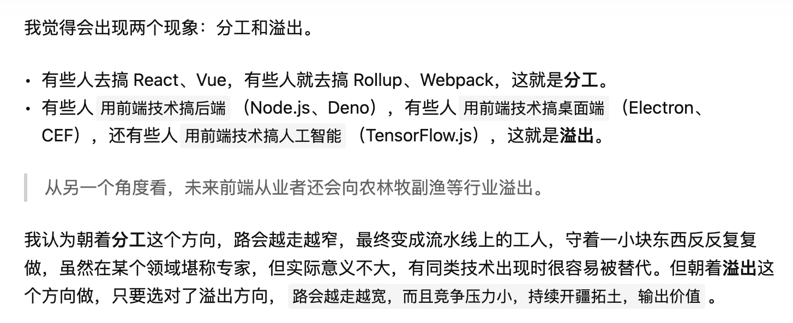

# 12-28

[vue2停止维护](https://blog.vuejs.org/posts/vue-2-eol)

然而用户可以购买`Vue2`的延长支持...(Never-Ending Support)，与`HeroDevs`合作，对于购买的用户提供持续更新和安全补丁

# 12-27

Yapi to TS

将接口文档转成TS接口和类型声明

社区实践参考：[yapi-to-typescript](https://github.com/fjc0k/yapi-to-typescript/tree/master)

美团内部目前发现一款基于它封装的工具

# 12-26

述职中老板们更关心数据指标，这方面确实需要加强，做一个技术项目数据指标的回收，是技术设计中不可缺少的一环。要明确统计口径

# 12-21

 抗日神曲：[show it ben](https://www.bilibili.com/video/BV1rN411H7b7/?spm_id_from=333.337.search-card.all.click)

# 12-13

年底了开始卷述职了要...

这几天kpi里的秒开指标拉了，一直在优化，但是很奇怪效果不明显，心累

# 12-4

1. 病愈回归第一天

2. 画图软件excalidraw

# 11-28

1. 工作以来最重一次生病，已经持续两天了，一直在发烧

2. 

# 11-27

生病发烧了，划了

# 11-25

- 最近流感人太多了，公司都是打喷嚏而且还不带口罩的，感觉大家都有报复心里，自己病了就不管不顾 -.-

- 今天打球右腿伤又复发了，还影响了发挥，本来以为已经恢复完全，谁知道又开始了，

- 今天一天都在解决`sourcemap`打包后URL和上传后URL不一致的问题，整体方案是基于公司基建`Nine`脚手架实现的，从`build`到`publish`插件源码都看了一遍，还研究下`Nine cli`的源码，学到了不少东西，还得思考总结沉淀下来。目前主流前端工程解决方案都包含插件式的设计

# 11-21

外包面试要告一段落了，大家水平真的参差不齐，反思下自己如果去面试，可能也是被无情pass，还得继续补足自己的基础和编程能力

高级外包的薪资也够高的

# 11-15

开始面试外包了，我做筛选很简单，就是看工作年限长的，并不关心年龄，可能年龄并不是需要我关心的...

从我面试的一个小伙子来看，虽然做的东西不少，但是基础能力薄弱，这里的基础并不包括技术知识，还有表达力，专业程度，在回答一个问题时，可以表现的很专业，措辞要准确，语言要严谨、层次清晰。

有同事面试完之后和我反应，感觉面试者各方面都还可以，就是32岁了年龄有点大。我无语...


# 11-7

遇到一个表单校验问题。

一般情况下，表单显示在页面上，可以直接调用 `Form.validate`方法进行校验。

但是诸如`elementUI`、`antd`这类表单，都是基于`DOM`校验，即页面上有表单`DOM元素`，校验才能生效，如果页面表单不存在，即使有`Form`实例，也无法发起校验。

解决方案：

可以用 [async-validator](https://github.com/yiminghe/async-validator)库来直接校验数据。这样的好处就是可以利用Form组件中的`rules`规则

用法：

```js
import Schema from 'async-validator';
const descriptor = {
  name: {
    type: 'string',
    required: true,
    validator: (rule, value) => value === 'muji',
  },
  age: {
    type: 'number',
    asyncValidator: (rule, value) => {
      return new Promise((resolve, reject) => {
        if (value < 18) {
          reject('too young');  // reject with error message
        } else {
          resolve();
        }
      });
    },
  },
};
const validator = new Schema(descriptor);
validator.validate({ name: 'muji' }, (errors, fields) => {
  if (errors) {
    // validation failed, errors is an array of all errors
    // fields is an object keyed by field name with an array of
    // errors per field
    return handleErrors(errors, fields);
  }
  // validation passed
});

// PROMISE USAGE
validator.validate({ name: 'muji', age: 16 }).then(() => {
  // validation passed or without error message
}).catch(({ errors, fields }) => {
  return handleErrors(errors, fields);
});

```

# 11-6

今天变天，太冷了，我还穿少了，明天多穿

# 11-1

流程编辑画布的交互真的太多了，表单多，通信多，antvx6的api也多...

# 10-30

`antv x6`很强大，但是这种流程画布的交互是真的多，今天只能划了

# 10-28

不讨厌库里了，反而开始喜欢他的打法，他的打法经验越来越老道，依旧稳定自信。

反而汤普森越看越不顺眼了，他最近还在搞续约的问题，自己打不出成绩，还想着漫天要价续约

77打球还是自己的学习模板

# 10-27

1. 遇到一个react + mobx用法上的疑惑：

在`observe store`中的属性之后，那么在组件中无论是对属性的读和写，都是响应式的，那么直接就可以这么写：
```js
import store from './store';

function Component() {
    const changeName = () => { store.name = 'xxx' }
    return (
        <div>{store.name}</div>
    )
}
```
这样就和`vuex`很像。

但是`mobx`又提供了`Provide inject`这样的通过`props`形式传入组件中来读取的用法。为什么不直接引入`store`来操作呢。


后来我明白了，道理很简单，通过在文件顶端`import store`形式固然可行，有个问题，如果`store`文件发生了变化，那么`import store`的所有子组件，子子组件都需要check一遍，做修改，这样就比较难维护。

所以通过`provide inject`，只要在根组件import一次，然后注入，那么就不需要再在子组件去import 文件了，节约了管理维护成本~ 

道理真的很简单，但当时就怎么也没有反应过来。。。

---

2. 今天在之前同事群聊聊前端发展问题，其实我是想问问大家对于今后发展，自己职业规划上，有什么思考建议的，但是却被一人提到了躺平的问题，感觉我们在说的一切都是在无意义的卷，不管往哪个方向努力、规划，最终都是无意义的。

我提到了玉伯之前讲的，前端人的发展方向，一个是技术产品，一个是技术专家，我觉得这个真的算是给前端人的一个方向吧，，，，但是看看他的回复：

- 都想的太多了

- 躺平了就不会摔倒了

- 干这个就是青春饭，有的人做的早成了老鸨，后面的人总想着自己也能成为老鸨

- 做啥新项目新业务都没用，市场需求就是那么大，再多的花活也是那点东西

他的话，我想了半天，我真的一点也没有过他的这种想法、不管我是不是天真，是不是不信所谓的努力也没啥意义，是不是什么青春饭、什么市场需求，我就是他妈的不服这种屁话。

在我的认知里，我对自己的要求就是干一行，就干好一行，可能我并不是真的热爱这一行，但是我依然要求自己要干好它，我真的想在前端这一行有一定建树，能找到自己的方向，有一席之地。我觉得我在探讨的前端方向，是一个很有意义的内容，并不是无聊的在吹嘘什么、甚至是炫耀什么（可能在他的视野里，我们在讨论的一起技术，都是在炫耀自己知道什么，其实最终我们压根也不会用它，哪些就是些花活）。

我已经31了，也是一个慢慢开始变得焦虑的年龄了，我以前的时候，压根没有这么正经的在群里探讨这些内容，甚至自己从来没有思考过。可能他还年轻，或者他的认知更高，完全和我们不是一个维度，所以他才会有这么一个结论。但是我和他不一样，我还要在这一行继续发展，方向对于我很重要，努力对于我更重要。他的话对我来说和放屁没什么两样，以后减少和他交流

> 减少无效社交

# 10-18

- 今天听了2个关于图像识别和AIGC的分享。一个是剧本式引导，一个是大模型在app小助手的落地，挺震撼的，里面有很多关于图像识别，AI模型的专业知识和概念，还有很多数学和图像名词术语，完全听不懂...很受打击，不过有些前端领域相关内容可以学习和借鉴

- 在做一个dag流程相关的需求，要用到antv x6，感觉这个东西设计的好牛逼，文档也贼友好，可以安排学习一波它的设计原理

# 10-16

- 最近膝盖开始疼起来了，除了酸疼之外，还有一种刺痛，有种不好的预感。正好朋友圈有人发恢复方法，可以试试了，带着凡凡一起，她也不舒服

# 10-13

- 今天快乐篮球，体验不错，最近练习还是有点用的，运球在视频中看起来流畅了很多，只不过最近投篮练得少，命中率低了很多，基本没怎么投进。。。还有一点就是体力比之前好多了，果然只要练就有用

# 10-12

很恶心的事，一个半年前统计的指标，到现在觉得有问题，然后找我再去核实。烦死了

明天又可以打球了，视频撸起~

# 10-11

[State of vite](https://www.bilibili.com/video/BV1K84y1U7J2/?spm_id_from=333.337.search-card.all.click&vd_source=b95c15ac90a8087a04184403c5e6a9c7)

[vite conf2023](https://viteconf.org/23/replay/welcome)

都提到了`Rust`语言，在前端领域应用愈来愈广泛，有点像TS的发展，是时候把它加入到学习项目中了...卷~

---

学到了一个解决流程编排的方案名词：DAG（有向无环图 Directed acyclic graph）

# 10-07

漫长假期终于快结束了，除了带娃之外，还玩起了视频剪辑，虽然用的是傻瓜式的剪映，但也是很需要花心思的。

还就是追了亚运会，女篮不亏是世界顶级，从世界杯到亚运会，每场都很惊艳。

# 10-05

好久没回家了，今天参加弟弟婚礼回去了，见了好多亲戚，还是挺开心的，以前见了家里人没什么太多话，但是这次还是唠了很多。

约了好几年没见的同学，那会的荷兰三剑客，再次聚首，还是当年学生时候那个感觉，变了的只是年龄大了，脸上有点变化哈哈，希望以后每年都有更多机会见面

# 10-03

连续用了两天GO3了，整体感觉还是不错的。

摄像区域并不能上下兼顾，比较常用的是比水平角度稍低一个档位，这样可以拍到球员大腿以上部分，稍作抬头就可以拍到篮筐，可以录制比赛或者是自己跑位训练。

如果是想拍自己运球，可以把摄像头完全拉倒最低档位，能拍到自己肚子以下位置，投篮时也可以拍到球框。

总结下来，可以分场景切换两种档位拍摄不同角度，完善视频效果。

---

已经连续几个月了，明天早晨都能出去打球一个小时，这都归功于老婆和老妈老爸的帮助，太感恩了，自从开始打球之后，每天精神头也比之前足了很多，感觉一天时间过得特别快，转眼一周一周的过。我也不知道自己拍视频目的是啥，也没想过能做个自媒体挣钱，可能初衷只是想记录一下生活，也可能是受帝师那个短视频影响的吧。

有时候会想，如果从很早的时候就开始接触篮球，一直打球训练，会不会有一天也会有一些成绩，可能进个校队、打个CUBA？再或者不定期打个业余联赛，靠这个为生，或者当个篮球视频博主？不知道，我也没什么后悔的，对于当初选择干程序员这一行，因为现在依然对篮球保持着热爱，每天还能打球，尽管时间不长，但是还是可以投篮、运球加速上篮，还可以视频记录，我已经很知足了。

# 10-02

今天insta GO3终于到了，但是夹在发带上还是不稳定，用力摇头时相机会上下跳动，因为发带有点软。不过我机智的老母亲帮我解决了这个问题，现在十分牢固，就期待明天录制效果咯。

还有小红书上有人用硅胶发带做的演示，可能效果也会比普通棉质发带好，以后可以尝试下，但是硅胶发带比较贵...

# 10-01

休假在家带娃很舒服，早晨还可以去打打球，一天精力都很充沛。今天还入手了insta360 GO3，明天到了体验下

# 09-29

今天是休假第一天，我早晨带着gopro去打球了，录了一大段视频，吃灰了好久的gopro终于又出山了，我3年前买的gopro7 black已经过时了，不过2.7k 60帧的效果还是不错的，不过录制一个8分钟的视频，就需要4个G，着实有点大了... 而且拍摄距离和相机位置摆放没有太把握好，下次可以优化下。

最近我心血来潮，想录一些第一视角打球视频，在网上看到一款insta 360 GO3，拇指相机，据说可以夹在发带上，完美解决打球运动下的拍摄场景，准备入手试一下~

# 09-24

又长了一岁，感觉自己这一年明白了挺多事情，从工作、生活，到以后如何陪伴娃子。希望自己可以越活越好，越来越通透，加油吧

# 09-23

工作接触到视频剪辑，看了下mac自带的工具`iMovie`，然后竟然发现还有阮一峰大佬的教学文档，学习一波[文章](http://www.ruanyifeng.com/blog/2019/07/imovie-tutorial.html)

# 09-22

最近头条看了很多关于篮球解说杨毅的视频，果然是名嘴，输出的观点有理有据，内容有力量让人信服，很佩服他的语言影响力。不同于其他解说，比如鲸雨，他属于属于内容质量高，外加方言特殊加持，二者都是解说行业的GOAT存在。他们除了语言功底优秀之外，更多的是对于专业领域深厚的积累和认知，可以将历史和身边实事用自己的理解加以润色之后输出。希望自己在前端领域也可以有足够的积累，并且锻炼表达能力，做一个知识的传播者。

# 09-20
好几天没随了，今天划水两句：

- 刷到一条短视频，讲的是拒绝在职场聊天工具里面使用“舔式回复”，比如语气词：“嗯嗯 嗯呢”，“...哈”，“好的呢”，“好的哦”，比如表情，“捂脸哭笑”，“大笑”等。而是直接用“好”，“行”，“知道了”等直接了当的词语回复，据说可以提升工作效率。我正在尝试... 今天还没有发过上述任何一个~

- 今天一天就在弄页面秒开优化后的感官体验，就是找不同手机，录几个视频gif，对比一下... 说实话真心挺累的，mp4转gif 也是挺麻烦。关键是在最后写文档作对比的时候，没办法控制优化前后页面同步动画展示，不知道有哪些好的方法可以帮助完成。。。

# 09-07
- 看了一篇文章[前端的三大怪谈：小程序，微前端，模块化](https://mp.weixin.qq.com/s/QM9Afif_0kv11IRVtu2FuA) ，思考为什么要？

- 看了一部赛车老电影，让人心潮澎湃，《极速车王》

# 08-31

> 成年人的疲惫，只有孩子才能治愈

这句话说的没毛病，今天娃子的呵呵傻笑，给我治愈了.. 

今天看了`react hooks`相关文章：

第一篇讲`useEvent`，说它和`useCallback`的故事，讲到了**闭包陷阱** 问题 。[原文](https://mp.weixin.qq.com/s/J_RUfn-kcynBme5FiE4mRg)

第二篇讲`useTransition` react原生实现**防抖**。[原文](https://mp.weixin.qq.com/s/3jgXS-2MtzsOPcp_Ga4OPA)

1. 提到了`lane`模型(用二进制来定义优先级，一共16个，本质就是位运算)

2. 提到了`entangle`机制（纠缠），配合`lane`使用，如果`laneA`和`laneB`纠缠，那么如果某次更新`react`选择了`laneA`，那么也得带着`laneB`...

3. 提到了【过期机制】，为了防止某些更新优先级太低，导致一直无法执行，每个更新都有个**过期时间**，如果在过期时间内它都没有执行，那么它就会过期。过期后它的更新优先级会变高(同步执行)。在文中给出的demo中，配合`lane`和相关的纠缠，会被一起执行，最终达到类似防抖效果。

第三篇讲`ref`不能乱用问题。[原文](https://mp.weixin.qq.com/s/bI3rohCePnay2JVsQvdtfg)

提到了防止`react`失控概念。举了几个较好的实践，包括使用`forwardRef`解决ref跨组件传递使用问题；`useImperativeHandle` 来限制`ref`中只存在可以被使用的方法。

总结一句话，`react`越来越难了，层出不穷的api，各种复杂新奇的概念，秀云了


# 08-29

- [react揭秘](https://react.iamkasong.com/) 是不错的react学习教程

- 明天有个校招生面试，第一次参与校招生面试，有点不知道面试尺度了，该问什么问题比较合理。可以有这几个方向：

- 计算机基础：进程、线程区别

- 网络相关：tcp握手，https协议，statusCode有哪些

- js：闭包，原型，es6api

- css：盒模型，布局

- 框架：react/vue

- 软素质：处理过比较复杂的事情，是怎么完成的

# 08-27

最近在学习`turbo`相关的内容，了解了`turborepo`这个`monorepo`的解决方案，官网的`examples`真的很亲民，有各种场景和技术的集成`demo`，这款产品虽然还不是真正的主流选型，但是确实具备非常大的潜力。

`turbo`的意思是“涡轮”，主打的就是一个性能，它将自身特点挖掘到极致，同时还可以与`monorepo`涉及到的其他功能的技术栈进行完美融合，而且还可以非侵入式的改造现有`monorepo`工程，仅需要添加配置`turbo.json`即可，迁移成本很低。

[官网在这里](https://turbo.build/repo)

# 08-26

今天玩了一个网易的篮球游戏，叫什么全明星街球，有点上瘾了，虽然知道也是氪金游戏，类似之前的TX 什么出的游戏，也玩过，但是都被氪金玩家暴打退游，但是也想体验一把 。哈哈

# 08-23

- 今天请假休息一天，基本啥也没干，刷了刷头条，都是讲24号日本排核废水的事，日本自己应该承担的责任，不仅不作为，还想拉着世界一起下水。看见新闻说要我国采取抵制，保卫海洋环境，不知道会有什么措施。

- 看见有同事发了一个chrome新特性，`Fetch Priority`，意思是可以设置浏览器获取资源优先级，[文章参考](https://cloud.tencent.com/developer/article/2311482)

# 08-22

- 今天难受了，以为是🐑了，结果庆幸不是，哈哈

- 篮球对的第一场比赛，赢了~ 很激烈，开始以为输了，上半场落后10多分，下半场顽强追回，最后还反超5分。对手确实很强，今天轮换阵容都是主力。。。

- 今天又看了2篇关于react文章：一篇是讲`Qwik`的的`Resumable`即**恢复**概念，PK`react`的`RSC`的。`Qwik`的作者是`Angular`之父。[原文](https://mp.weixin.qq.com/s/MSQcDUyOHZLs9xNn6Nob4g)。另一篇是讲`react`的`RSC`的，哈哈，正好前后呼应，[原文](https://mp.weixin.qq.com/s/TFxQSwOLQJWBC-ErWaHS9Q)在这里。回头把里面核心概念摘录出来整理回顾一下~


# 08-20

最近关注了一个叫魔术师卡颂的微信公众号，小伙子的原创文章很不错，很多关于`react`的干活。看了他的介绍，自己通过写原创文章增加了个人影响力，之后还受邀进行课程录制，咨询顾问，面试培训等工作，算是同行中的佼佼者。瑞思拜

# 08-18

- 今天如约而至的篮球局，打的很舒服，2小时猛灌2L水，加了电解质以后确实能感觉到效果。哈哈哈

- 今天看到一篇文章，是写用AIGC来帮我们阅读项目源码的，使用的工具叫做`bloop`，具体我还没有上官网看过。它里面大概介绍了下`bloop`背后原理，举了个例子，有个ppt AI项目，提到一个PPT如果有几百页，而GPT的token可能无法覆盖，所以这里提到一种算法，大致意思就是通过将 **高维数据转为低维向量**（这里没懂，啥事纬度向量...）将海量内容进行切片分隔成多个低维向量，根据用户输入的自然语言，从低维向量中找到有关系的部分，打包发给GPT，最终返回自然语言的结果。
**高维向量，低维向量**是机器学习中的概念，用这种算法解决问题，也是比较有趣的，以后可以多了解下，狗头~


# 08-12

养娃的焦虑... 昨天我媳妇突然说了个同卵双胞胎长得不完全一样，会不会是医院给抱错了，虽然觉得不可能，但是这个想法一直在我脑子里转，我也会时不时观察两个孩子区别... 

今天娃子不怎么好好睡觉，哄着没一会就醒了，反复了3-4次，我人都有点麻了，再加上晚上休息不好，整个人一下午都是恍惚的。

哈哈哈... 习惯就好
# 2023-08-11

从上周开始参与了公司举办的篮球赛。本以为自己水平还可以，起码打个首发，结果自己太水了... 上场后很紧张，完全适应不了5V5全场的节奏。上周第一次热身赛，我穿了77号，可惜表现太差，一个球没进，光跟着折返跑了。。。不过我还是有点认知的，自己水平不行，就乖乖去当替补，在旁边学习就行了。

今天第二次热身赛，队长也没有主动让我出场，可能也不知道我叫什么名字吧 ... 不过我自己主动请战，这次从容很多，虽然多次贡献失误，1次传球，1次回场，1次运球砸脚，但是这次进了4、5个球，有些机会都把握住了。有进步，有进步，继续加油吧，今天就到这里了。

开了一个随笔的头。哈哈，其实是今天划水了